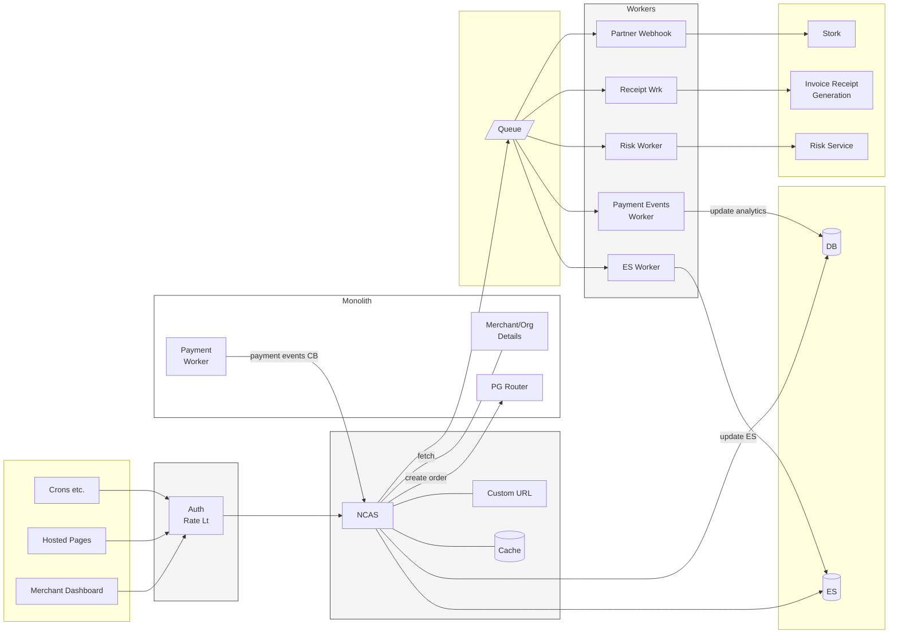
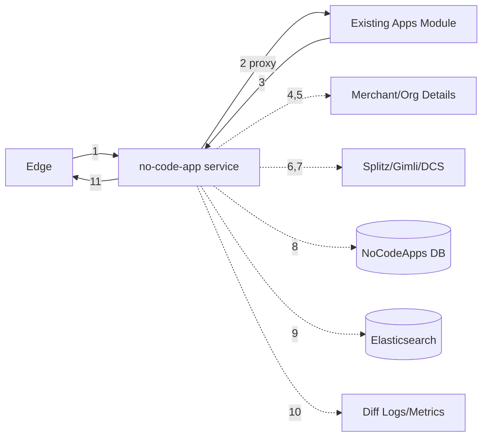
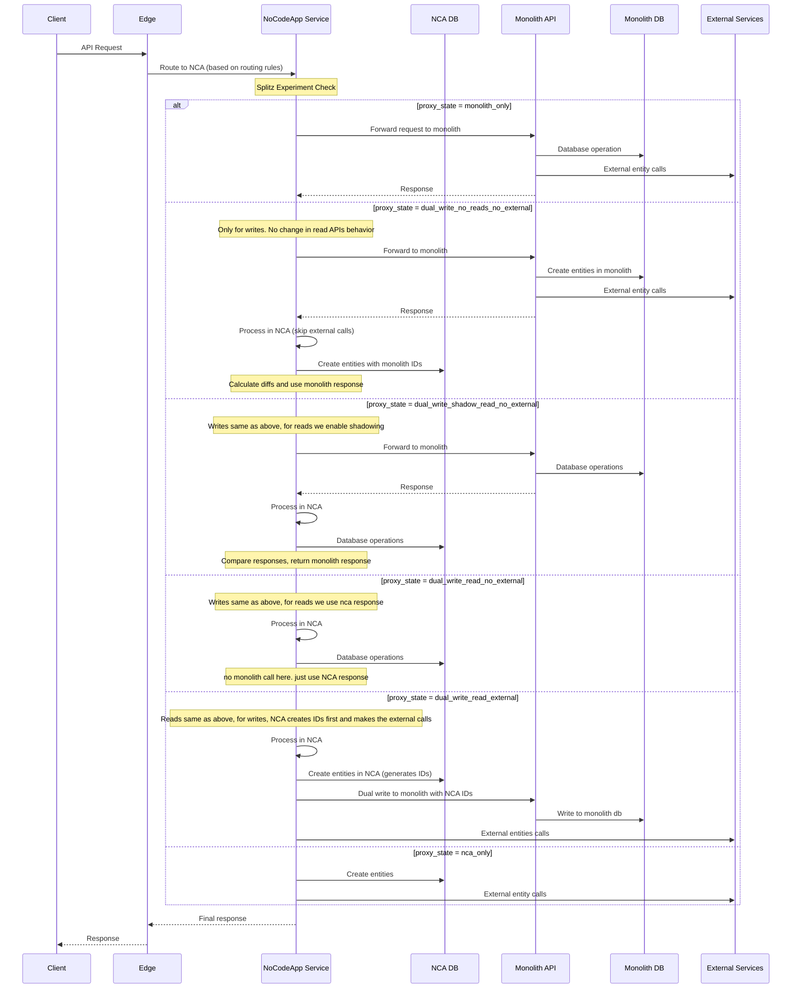

# Overview

This document outlines the decomposition of **Payment Pages** functionality from the monolithic API service to the NoCodeApp (NCA) service, including current architecture, target state, migration flows, and implementation tasks.

---

# Target State Architecture

The target state after full migration - NCA service will serve all Payment Pages traffic independently.

---

# Migration Phase Architecture

During migration, NCA acts as a proxy layer handling dual writes, shadowing, and gradual traffic shift.

**Components:**
- **Edge**: Entry point, routes requests to NCA
- **NCA (no-code-app service)**: Central service handling proxying, dual writes, shadowing
- **Monolith**: Contains Existing Apps Module (proxied) and Merchant/Org Details
- **New NCA Infrastructure** (dotted lines): NoCodeApps DB, Elasticsearch, Diff Logs, Splitz/Gimli/DCS

**Migration Flow Steps:**
1. Edge routes request to NCA service
2. NCA proxies request to Monolith's Existing Apps Module
3. Monolith returns response
4. NCA fetches merchant/org details from Monolith
5. Merchant data returned
6. NCA checks Splitz/Gimli/DCS for experiment flags
7. Flag configuration returned
8. NCA performs dual write to its own DB
9. NCA indexes data to Elasticsearch
10. NCA logs diffs/metrics for comparison
11. Final response returned to Edge

---

# Request Flow during Migration

## Database Architecture & ID Reuse Pattern

The migration uses separate databases for Monolith and NCA services with a specific ID reuse strategy:

- **Monolith DB**: Existing database used by the monolith API
- **NCA DB**: New database used by NoCodeApp service
- **ID Reuse Pattern**:
    - **States `dual_write_no_reads_no_external` through `dual_write_read_no_external`**: Entities created in Monolith first, then NCA uses same IDs
    - **State `dual_write_read_external`**: Entities created in NCA first, then copied to Monolith with same IDs
    - **State `nca_only`**: Only NCA DB is used

## Request Flow - Write/Read APIs

**APIs covered by this flow:**

### Write APIs (Need NCA proxy for dual write)

| API Route Name | Route Signature | Description | Status |
|----------------|-----------------|-------------|--------|
| `payment_page_create` | `POST /payment_pages` | Create a payment page (shared by buttons, subscription_buttons, pages, file_upload_page) | |
| `payment_page_update` | `PATCH /payment_pages/{id}` | Update a payment page | |
| `payment_page_create_order` | `POST /payment_pages/{id}/order` | Create Order | |
| `payment_page_set_receipt_details` | `POST /payment_pages/{id}/receipt` | Set receipt details for a page | |
| `payment_page_activate` | `PATCH /payment_pages/{id}/activate` | Activate a payment page | |
| `payment_page_deactivate` | `PATCH /payment_pages/{id}/deactivate` | Deactivate a payment page | |
| `payment_page_item_update` | `PATCH /payment_pages/payment_page_item/{id}` | Update a payment page item | |

### Read APIs

| API Route Name | Route Signature | Description | Status |
|----------------|-----------------|-------------|--------|
| `pages_view` | `GET/POST /pages/{x_entity_id}/view` | Hosted page view by page id | |
| `pages_view_by_slug` | `GET/POST /pages/{slug}` | Hosted page view by slug | |
| `pages_view_by_slug_empty` | `GET/POST /pages` | Hosted page view by empty slug | |
| `payment_page_list` | `GET /payment_pages` | Get list of pages for a merchant | |
| `payment_page_get` | `GET /payment_pages/{id}` | Get payment page by ID | |
| `payment_page_get_details` | `GET /payment_pages/{id}/details` | Get detailed information on a page | |
| `payment_page_view_get` | `GET/POST /payment_pages/{x_entity_id}/view` | Hosted page view by page id | |
| `payment_page_get_invoice_details` | `GET /payment_pages/{payment_id}/receipt` | Fetch receipt details for a page | |
| `payment_page_notify` | `POST /payment_pages/{id}/notify` | Sends notification to end customer | |
| `payment_page_send_receipt` | `POST /payment_pages/{payment_id}/send_receipt` | Send receipt details to end user | |
| `payment_page_save_receipt_for_payment` | `POST /payment_pages/{payment_id}/save_receipt` | Save receipt for a payment | |
| `fetch_product_details_for_order` | `GET orders/{id}/product_details` | Get payment page details from order id (specific to pages and buttons) | |
| `payment_page_slug_exists` | `GET /payment_pages/{slug}/exists` | Check if slug exists already | |
| `payment_page_expire_cron` | `POST /payment_pages/expire` | Called from cron to expire a page (Internal) | |

