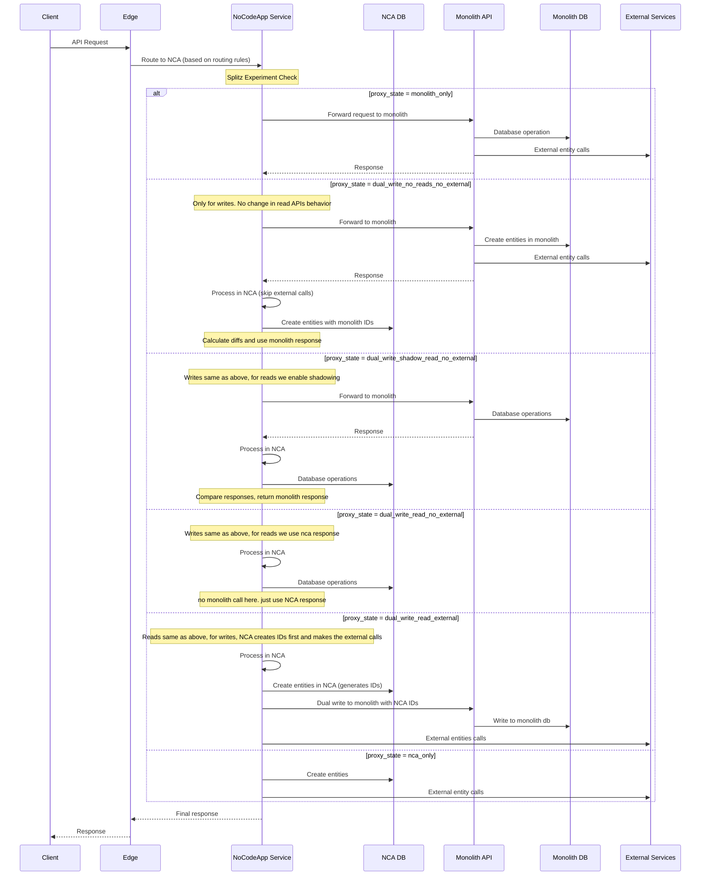

# Overview
This document outlines the decomposition of payment handle functionality from the monolithic API service to the NoCodeApp (NCA) service, including current patterns, migration flows, and implementation tasks.

# Request Flow during Migration

## Database Architecture & ID Reuse Pattern

The migration uses separate databases for Monolith and NCA services with a specific ID reuse strategy:

- **Monolith DB**: Existing database used by the monolith API
- **NCA DB**: New database used by NoCodeApp service
- **ID Reuse Pattern**:
    - **States `dual_write_no_reads_no_external` through `dual_write_read_no_external`**: Entities created in Monolith first, then NCA uses same IDs
    - **State `dual_write_read_external`**: Entities created in NCA first, then copied to Monolith with same IDs
    - **State `nca_only`**: Only NCA DB is used

## Request Flow - Write/Read APIs

**APIs covered by this flow:**
<--TODO: update the APIs>
**Write APIs:**
- `payment_handle_create` - `POST /payment_handle`
- `payment_handle_update` - `PATCH /payment_handle`
- `payment_page_create_order` - `POST /payment_pages/{id}/order` (when view_type is handle)
- `payment_page_set_merchant_details` - For handle-related settings

**Read APIs:**
- `payment_handle_get` - `GET /payment_handle`
- `payment_handle_availability` - `GET /payment_handle/{slug}/exists`
- `payment_handle_suggestion` - `GET /payment_handle/suggestion`
- `payment_handle_amount_encryption` - `POST /payment_handle/custom_amount`
- `pages_view_by_slug` - `GET /pages/{slug}` (for payment handles)
- `payment_page_get_details` - For handle details from dashboard
- `payment_page_get` - Handle-related page data
- `payment_page_fetch_merchant_details` - For handle-related settings

