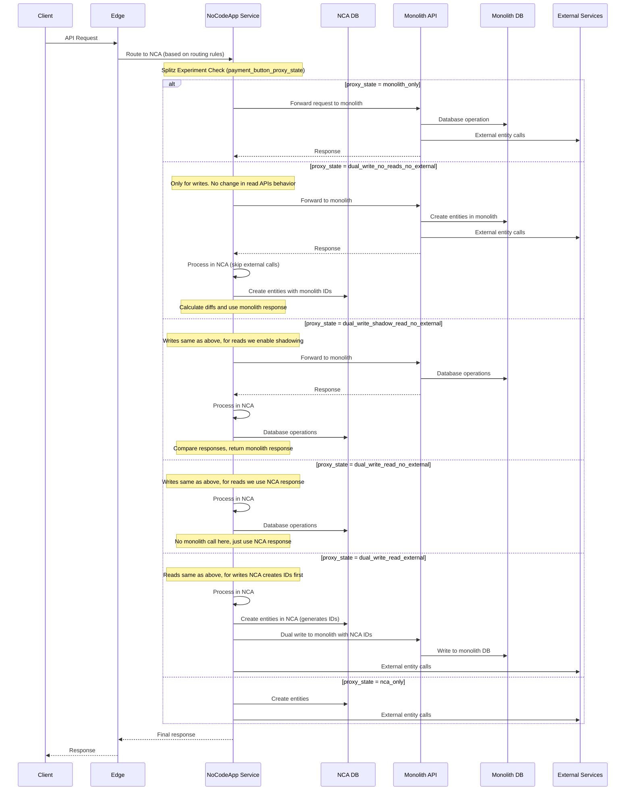
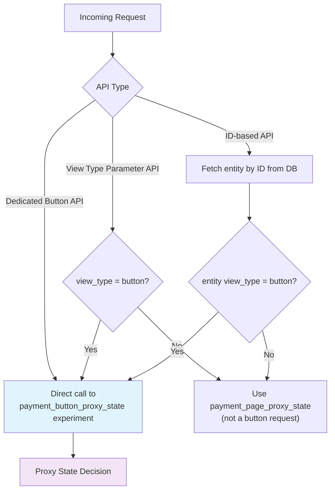
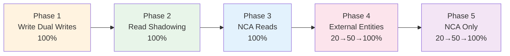

# Overview

This document outlines the decomposition of **Payment Buttons** functionality from the monolithic API service to the NoCodeApp (NCA) service, including current APIs, migration flows, and implementation tasks.

Payment buttons are built on top of payment pages and follow the same migration patterns. We reuse a large portion of the code and infrastructure from the payment pages migration.

> **⚠️ IMPORTANT:** NCA code is written to **exactly mimic monolith behavior**. Any mismatch between NCA and monolith responses is a bug that needs fixing. **Monolith is the source of truth** until NCA becomes reliable.

---

# Table of Contents

1. [Goals](#goals)
2. [Current APIs and Behaviour](#current-apis-and-behaviour)
3. [Request Flow During Migration](#request-flow-during-migration)
4. [Implementation](#implementation)
5. [Appendix](#appendix)

---

# Goals

- Move the business logic related to payment buttons out of the API monolith to the NoCodeApp service.
- Migrate payment button related entities from monolith DB to the NoCodeApp service without downtime or consistency issues.

---

# Current APIs and Behaviour

## Overview

Payment buttons are built on top of payment pages. They allow merchants to embed payment collection directly into their websites. Behind the scenes, a payment button is a payment page entity with a few additional configuration options:

- **Button Text:** Customizable text (max 20 characters)
- **Button Theme:** Visual theme (e.g., `rzp-dark-standard`, `light`)
- **Branding:** Can disable Razorpay branding (`pp_button_disable_branding`)
- **Amount:** Fixed or variable amounts
- **Template:** e.g., buy-now, donation
- **UDF Schema:** Custom fields for customer information

We currently support four different types of buttons.

## APIs

### Dedicated Payment Button APIs

| API Route Name | Route Signature | Method | Description |
|----------------|-----------------|--------|-------------|
| `payment_button_hosted_view` | `payment_buttons/{x_entity_id}/view` | GET, POST | Render the hosted payment button view |
| `payment_page_hosted_button_preferences` | `payment_buttons/{x_entity_id}/button_preferences` | GET | Configure appearance and behavior of hosted button (text, theme, branding, colors) |
| `payment_page_hosted_button_details` | `payment_buttons/{x_entity_id}/button_details` | GET | Comprehensive button info including merchant details, payment links, settings, org |

> **Note:** The hosted view API has both GET and POST. POST is still read-only and involves extra validations and payload data for rendering.

### Payment Page APIs with Button's Query Parameter

| API Route Name | Route Signature | Method | Description |
|----------------|-----------------|--------|-------------|
| `payment_page_create` | `payment_pages?view_type=button` | POST | Create a payment button |
| `payment_page_list` | `payment_pages?view_type=button` | GET | List payment buttons for a merchant |
| `nca_store_payments` | `stores/{pl_link}/payments?type=button` | GET | Fetch all payments for a payment button |

### Deprecated APIs (Zero Traffic)

See [Appendix A.1](#a1-deprecated-apis) for the full list.

---

# Request Flow During Migration

Once APIs are proxied via NCA, the flow varies based on the **proxy state** of the merchant, controlled by the `payment_button_proxy_state` Splitz experiment.

The proxy state definitions remain the same as described in the payment pages decomposition spec.

## Database Architecture & ID Reuse Pattern

- **Monolith DB**: Existing database used by the monolith API
- **NCA DB**: New database used by NoCodeApp service
- **ID Reuse Pattern**:
  - **States `dual_write_no_reads_no_external` through `dual_write_read_no_external`**: Entities created in Monolith first, then NCA uses same IDs
  - **State `dual_write_read_external`**: Entities created in NCA first, then copied to Monolith with same IDs
  - **State `nca_only`**: Only NCA DB is used

## Request Flow - Write/Read APIs

**APIs covered by this flow:**

**Write APIs:**
- `payment_page_create` — `POST /payment_pages?view_type=button`
- `payment_page_update` — `PATCH /payment_pages/{id}` (when view_type is button)

**Read APIs:**
- `payment_button_hosted_view` — `GET/POST /payment_buttons/{x_entity_id}/view`
- `payment_page_hosted_button_preferences` — `GET /payment_buttons/{x_entity_id}/button_preferences`
- `payment_page_hosted_button_details` — `GET /payment_buttons/{x_entity_id}/button_details`
- `payment_page_list` — `GET /payment_pages?view_type=button`
- `nca_store_payments` — `GET /stores/{pl_link}/payments?type=button`

## Proxy State Logic by API Type

---

# Implementation

## 5.1 Basic Proxy Implementation

Implement proxy logic for all payment button APIs. Initially, all requests are proxied to the monolith.

**New APIs to be served via NCA:**

**Dedicated Payment Button APIs:**
- `payment_button_hosted_view` — `GET/POST /payment_buttons/{x_entity_id}/view`
- `payment_page_hosted_button_preferences` — `GET /payment_buttons/{x_entity_id}/button_preferences`
- `payment_page_hosted_button_details` — `GET /payment_buttons/{x_entity_id}/button_details`

**Payment Page APIs (routed when view_type=button):**
- `payment_page_create` — `POST /payment_pages?view_type=button`
- `payment_page_list` — `GET /payment_pages?view_type=button`
- `nca_store_payments` — `GET /stores/{pl_link}/payments?type=button`

## 5.2 Edge Changes

- **Routing Rules**: Update edge routing to direct payment button APIs to NCA

**APIs to add routing at Edge:**
- `payment_button_hosted_view`
- `payment_page_hosted_button_preferences`
- `payment_page_hosted_button_details`

- **Monitoring**: Set up monitoring and dashboards for the NCA routes at both edge and service level.

## 5.3 API Implementation in NCA

### Write APIs

These APIs reuse the existing payment page API logic with a few extra validations in NCA depending on `view_type`.

- **`payment_page_create`** — Create new payment buttons
- **`payment_page_update`** — Update existing payment buttons

### Read APIs

Some read APIs only need `view_type` query parameter handling in existing payment page APIs.

- **`payment_page_list`** — Get the list of payment buttons on the merchant dashboard
- **`nca_store_payments`** — Fetch all payments related to a payment button
- **`payment_button_hosted_view` (GET and POST)** — Render the payment button hosted view (template: `payment_link/hosted_with_udf.blade.php`). Template is already migrated in NCA and can be reused.
- **`payment_page_hosted_button_preferences`** — Configure appearance and behavior of hosted payment buttons (text, theme, branding, colors)
- **`payment_page_hosted_button_details`** — Comprehensive button information including merchant details, payment links, button settings, org, etc.

### Payment Flows

- Ensure payment notification API is configured for buttons.

## 5.4 Experiment Configuration

### Splitz Experiment Setup

- **Experiment Name**: `payment_button_proxy_state`
- **Based on**: Clone of existing payment page experiment
- **Purpose**: Control proxy state for payment button APIs

### Proxy State Logic by API Type

- **Dedicated Payment Button APIs**: Direct call to `payment_button_proxy_state` experiment.
- **View Type Parameter APIs**: Check request `view_type` parameter first. If `view_type` is `"button"`, call `payment_button_proxy_state` experiment.
- **ID-based APIs**: Fetch entity by ID from database and check entity's `view_type`. If `view_type` is `"button"`, call `payment_button_proxy_state` experiment.

### Implementation Details

- **Diff Calculation**: Reuse existing diff calculation setup from payment pages.
- **ID Management**:
  - Create operations: Reuse IDs from monolith response.
  - Update operations: No ID reuse needed.
- **Dual Writes**: Make changes to support reverse dual writes for all write APIs.
- **Fallback**: Default to `monolith_only` state for any experiment failures.

## 5.5 Migration Phases

> **⚠️ Important Note**: The migration should not happen before the proxy state for buttons has been properly set up.

### Data Migration Phase

- Run the migration script for all existing merchants.

### Dual Writes Rollout

| Phase | Description | Duration |
|-------|-------------|----------|
| **Phase 1** | Write API Dual Writes — 100% dual writes after NCA write APIs implementation | 2 days active bug fixes + 4 days wait period |
| **Phase 2** | Read API Shadowing — 100% shadowing for read APIs | 2 days active bug fixes + 4 days wait period |
| **Phase 3** | NCA Read Migration — 100% NCA reads | 2 days continuous monitoring |
| **Phase 4** | External Entity Migration — 20% → 50% → 100% progressive rollout | 2 days monitoring each step |
| **Phase 5** | Complete Migration — 20% → 50% → 100% NCA only | 2 days monitoring each step |

## 5.6 Rollback

The proxy states are designed to be stacked on top of each other, so we can always fall back to the previous proxy state in case of issues. With extensive diff monitoring over long periods, issues should be rare.

---

# Appendix

## A.1. Deprecated APIs

The following APIs have been identified as deprecated with zero traffic in the last week and are **out of scope** for this migration:

| API Route Name |
|----------------|
| `payment_button_create` |
| `payment_button_get_details` |
| `payment_button_update` |
| `payment_button_item_update` |
| `payment_button_deactivate` |
| `payment_button_activate` |
| `payment_button_create_order` |
| `payment_button_create_order_option` |
| `payment_button_hosted_preferences` |
| `payment_button_hosted_button_details` |
| `payment_button_set_merchant_details` |
| `payment_button_fetch_merchant_details` |
| `payment_button_send_receipt` |
| `payment_button_set_receipt_details` |
| `payment_button_get_receipt_details` |
| `payment_button_save_receipt_for_payment` |
| `payment_button_get` |
| `payment_button_list` |
