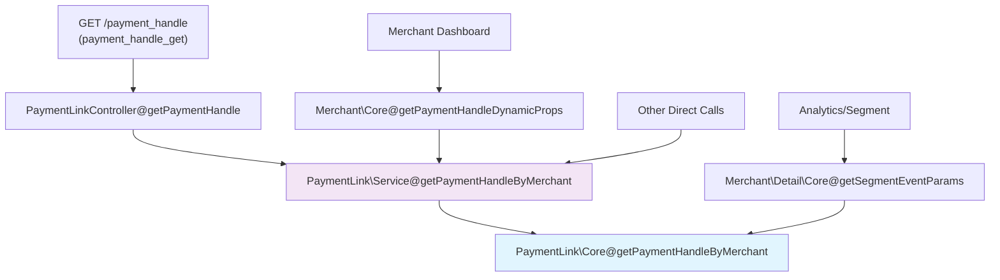
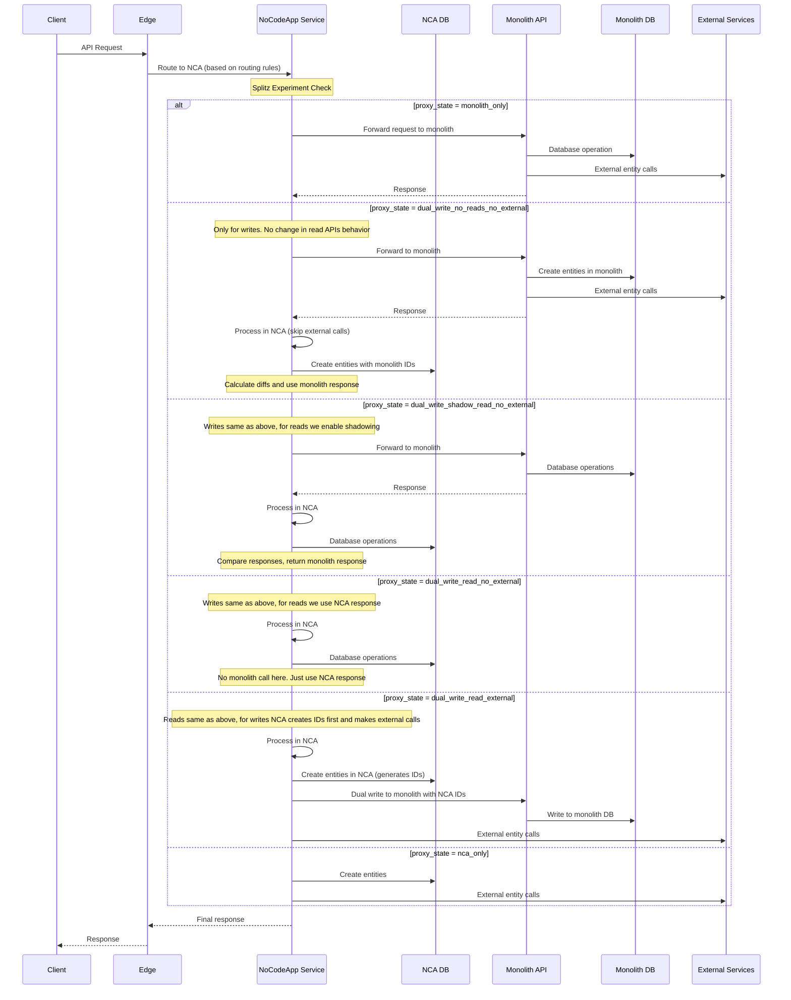
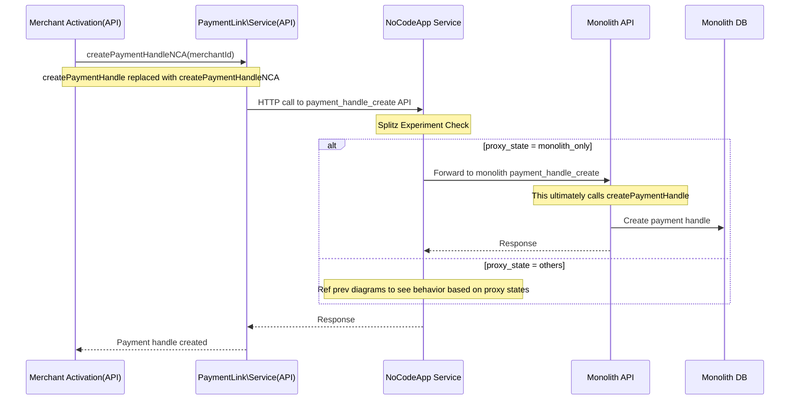
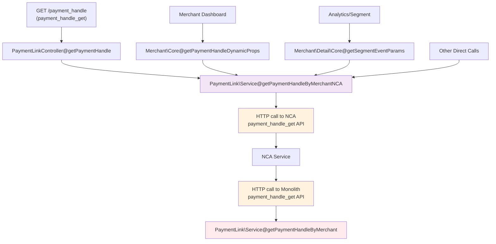

# Payment Handles API Decomposition Spec

**Author/s:**
**Team/Pod:** NocodeApps | BU: Payments

---

# 1. Overview

This document outlines the plan for the decomposition of payment handle functionality from the API service to the NoCodeApp (NCA) service, including a brief overview about the current flows, migration strategies, and the implementation tasks.

Since payment handles are just a type of payment pages, most of the functional details are skipped here. We'd be using very similar migration strategies as that of payment pages — described in more detail in the related Payment Pages decomposition spec.

---

# 2. Write Patterns

Payment handle creations happen during the merchant activation flows — so there are direct function calls to create payment handles in the merchant service code apart from the APIs. The APIs are being used in some alternative implementations of the same flow.

## 2.1. Writes through APIs

**Dedicated Payment Handle Write APIs:**
- `payment_handle_create` - `POST /payment_handle`
- `payment_handle_update` - `PATCH /payment_handle`

**APIs based on view_type parameter:**
- `payment_page_create_order` - `POST /payment_pages/{id}/order`

**Note**: Deprecated APIs with 0 traffic (excluded from scope): `payment_handle_update_old` (`PATCH /payment_handle/{id}`), `payment_handle_precreate` (`POST /precreate_payment_handle`)

## 2.2. Writes through Function Calls

- **`PaymentLink\Service@createPaymentHandle`**
  - Used to create payment handles during merchant activation and instant activation
  - Called from: `app/Models/Merchant/Activate.php` (lines 223, 383)

**Note**: Deprecated function call: `PaymentLink\Service@createPaymentHandle` from PaymentPageProcessor (background job processing)

---

# 3. Read Patterns

## 3.1. Reads through APIs

**Dedicated Payment Handle APIs:**
- `payment_handle_availability` - `GET /payment_handle/{slug}/exists` (Called during onboarding)
- `payment_handle_get` - `GET /payment_handle` (Called after clicking on rzp.me link in Merchant Dashboard's sidebar)
- `payment_handle_suggestion` - `GET /payment_handle/suggestion` (Called during onboarding)
- `payment_handle_amount_encryption` - `POST /payment_handle/custom_amount` (Called on clicking Share from Merchant Dashboard)

**APIs based on ID:**
- `pages_view_by_slug/pages_view/payment_page_view_get` - `GET /pages/{slug}` (Customer's view)
- `payment_page_get_details` (from dashboard)
- `payment_page_get` (not called but should maintain the same behavior)

**APIs based on query params:**
- `payment_page_list` - `GET /payment_pages` (from merchant dashboard)

**APIs with no changes needed:**
- `orders/{order_id}/product_details` - Not supported currently for handles, no edits needed
- `payment_page_expire_cron` - No changes needed, just ensure handles aren't expired

## 3.2. Reads through Function Calls

- **`\RZP\Models\PaymentLink\Core::getPaymentHandleByMerchant`**
  - Called from:
    - `\RZP\Models\PaymentLink\Service::getPaymentHandleByMerchant` (via `payment_handle_get` API)
    - `\RZP\Models\Merchant\Core::getPaymentHandleDynamicProps` (for merchant dashboard)
    - `\RZP\Models\Merchant\Detail\Core::getSegmentEventParams` (for analytics)

The dataflow and interaction between function calls is shown in the diagram below:



**Note**: No deprecated function calls identified for read patterns.

---

# 4. Merchant Settings APIs

**Current Settings Usage Analysis:**
```sql
select key, count(*) as count from realtime_hudi_api.settings
where module='payment_link' and entity_type='merchant' and created_date>='2025-01-01'
group by key order by count desc;
```

**Payment Link Module Settings (4 keys total):**

| Setting Key | Count | Usage |
|-------------|-------|-------|
| `default_payment_handle.default_payment_handle_page_id` | 232,923 | Payment handles |
| `default_payment_handle.default_payment_handle` | 232,909 | Payment handles |
| `text_80g_12a` | 644 | Payment pages (80G details) |
| `image_url_80g` | 644 | Payment pages (80G details) |

**APIs to be migrated:**
- `payment_page_set_merchant_details`
- `payment_page_fetch_merchant_details`

These APIs only edit and fetch the 80g details; the handle related keys are used by the payment handle APIs only.

**Migration Plan for these settings:**
- **80G details**: These settings will be migrated to NCA configs table and the APIs will be moved to NCA.
- **Handle settings**: The handle settings used by the handle APIs will be stored in the NCA configs table and will be read by monolith in the read calls discussed in Read Patterns.
- **Data migration**: Once the APIs are migrated, we can proceed with the data migration and dual writes on these APIs just like others.

---

# 5. Request Flow during Migration

## 5.1. Request Flow - Write/Read APIs

Once an API is proxied via NCA, the flow varies based on the proxy state of the merchant — which is configured on the payment handle's splitz experiment.

The proxy state definitions remain the same as payment pages. Key notes:
- We create a new experiment for handles to route traffic based on merchant ID and migration phase.
- Unique IDs (payment handle ID, item ID, etc.) are kept in sync between monolith and NCA during dual writes by reading the responses.
- External entity creations always happen from either NCA or monolith (never both) to avoid duplicates; a separate proxy state handles the switch for gradual rollout.



## 5.2. Request Flow - createPaymentHandle Function Calls

The request flow in case of the `createPaymentHandle` function calls would be very similar to the Write/Read API flow — just that the API would be triggered from monolith via an HTTP call:



## 5.3. Request Flow - getPaymentHandleByMerchant Function Calls

The request flow would be very similar to the above `createPaymentHandle` function call, except the API called would be `payment_handle_get` instead of `payment_handle_create`. The function `getPaymentHandleByMerchantNCA` would be used in place of `getPaymentHandleByMerchant`.

We'd also have to change some function calls in the merchant activation flows to call the NCA `payment_handle_get` API. The dataflow and interaction between function calls is shown in the diagram below:



---

# 6. Major Tasks

## 6.1. NoCodeApp Service Implementation

### 6.1.1. Basic Proxy Implementation

Implement proxying logic for all payment handle APIs where initially we proxy all requests to monolith. This involves setting up the routes and controllers and proxying the request directly to monolith.

**New APIs to be served via NCA:**

**Dedicated Payment Handle APIs:**
- `payment_handle_create` - `POST /payment_handle`
- `payment_handle_update` - `PATCH /payment_handle`
- `payment_handle_availability` - `GET /payment_handle/{slug}/exists`
- `payment_handle_get` - `GET /payment_handle`
- `payment_handle_suggestion` - `GET /payment_handle/suggestion`
- `payment_handle_amount_encryption` - `POST /payment_handle/custom_amount`

**Merchant Settings APIs:**
- `payment_page_set_merchant_details`
- `payment_page_fetch_merchant_details`

**New Function Call APIs (HTTP endpoints created to replace monolith function calls):**
- `payment_handle_create_nca` - HTTP endpoint for `PaymentLink\Service@createPaymentHandleNCA`
- `payment_handle_get_nca` - HTTP endpoint for `PaymentLink\Core@getPaymentHandleByMerchantNCA`

### 6.1.2. Function Calls to be Replaced with APIs in Monolith

**Create Operations:**
- Replace `PaymentLink\Service@createPaymentHandle` with `PaymentLink\Service@createPaymentHandleNCA`
- Update calls in merchant activation flows (`app/Models/Merchant/Activate.php`)
- New function makes HTTP calls to NCA's `payment_handle_create` API

**Read Operations:**
- Replace `PaymentLink\Core::getPaymentHandleByMerchant` with `PaymentLink\Core::getPaymentHandleByMerchantNCA`
- Update calls from:
  - `PaymentLink\Service::getPaymentHandleByMerchant`
  - `Merchant\Core::getPaymentHandleDynamicProps`
  - `Merchant\Detail\Core::getSegmentEventParams`
- New function makes HTTP calls to NCA's `payment_handle_get` API

## 6.2. Edge Changes

Once the proxying changes in 6.1.1 are done, we can start routing production traffic to NCA from edge. At this stage of migration, NCA just proxies the request back to monolith.

- **Routing Rules**: Update edge routing to direct payment handle APIs to NCA.

**APIs to add routing at Edge:**
- `payment_handle_create`
- `payment_handle_update`
- `payment_handle_availability`
- `payment_handle_get`
- `payment_handle_suggestion`
- `payment_handle_amount_encryption`
- `payment_page_set_merchant_details`
- `payment_page_fetch_merchant_details`

- **Monitoring**: Set up monitoring and dashboards for the NCA routes at both edge and service level.

## 6.3. API Implementation in NCA

**Create APIs:**
- `payment_handle_create` - Create new payment handles
- `payment_handle_update` - Update existing payment handles

**Read APIs:**
- `payment_handle_get` - Get payment handle by merchant
- `payment_handle_availability` - Check slug availability
- `payment_handle_suggestion` - Generate handle suggestions
- `payment_handle_amount_encryption` - Encrypt custom amounts
- `pages_view_by_slug` - Serve hosted pages. Payment handle hosted page template needs to be migrated.

**Payment Flows:**
- Make sure payment notification API is configured for handles.

**Others:**
- `payment_page_set_merchant_details` - CRUD APIs on merchant settings
- `payment_page_fetch_merchant_details`

## 6.4. Experiment Configuration

### 6.4.1. Proxy State Logic by API Type

We create a new experiment (`payment_handle_proxy_state`) that's a clone of the existing payment page proxy experiment, which would be called to decide the proxy state of the merchant for all handle flows.

- **Dedicated Payment Handle APIs**: Direct call to `payment_handle_proxy_state` experiment.
- **View Type Parameter APIs**: Check request `view_type` parameter first. If `view_type` is "handle", call `payment_handle_proxy_state` experiment.
- **ID-based APIs**: Fetch entity by ID from database and check entity's `view_type`. If `view_type` is "handle", call `payment_handle_proxy_state` experiment.

### 6.4.2. Implementation Details

- **Diff Calculation**: Reuse existing diff calculation setup from payment pages
- **ID Management**:
  - Create operations: Reuse IDs from monolith response
  - Update operations: No ID reuse needed (only slug and merchant settings updates)
- **Dual Writes**: Make changes to support reverse dual writes for all write APIs
- **Fallback**: Default to `monolith_only` state for any experiment failures

## 6.5. Migration Phases

> **⚠️ Important Note**: The migration should not happen before the proxy state for handles has been properly set up.

### 6.5.1. Data Migration Phase
- Modify the migration script to transfer merchant settings from monolith to NCA.
- Run the migration script for all existing merchants during low-traffic hours.

### 6.5.2. Dual Writes Rollout

- **Phase 1: Write API Dual Writes** - 100% dual writes after NCA write APIs implementation, 2 days active bug fixes
- **Phase 2: Read API Shadowing** - 100% shadowing for read APIs, 2 days active bug fixes + 4 days wait period
- **Phase 3: NCA Read Migration** - 100% NCA reads, 2 days continuous monitoring
- **Phase 4: External Entity Migration** - 20% → 50% → 100% progressive rollout, 2 days monitoring each step
- **Phase 5: Complete Migration** - 20% → 50% → 100% NCA only, 2 days monitoring each step

## 6.6. Rollback

The proxy states are designed to be stacked on top of each other, so we can always fall back to the previous proxy state in case of issues. As we are doing extensive diff monitoring for long periods of time, there shouldn't be any issues in the first place.
