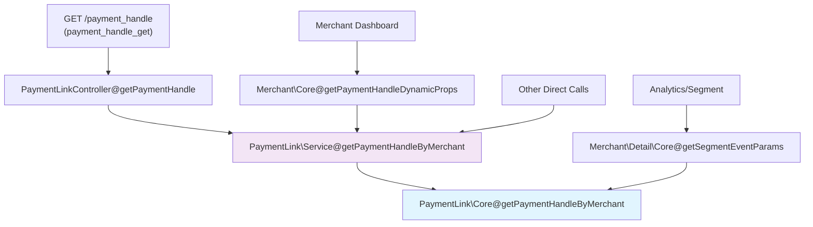
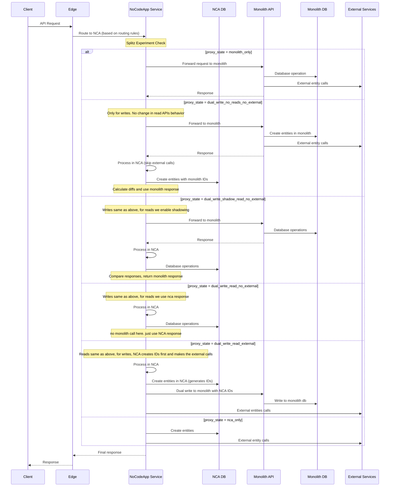
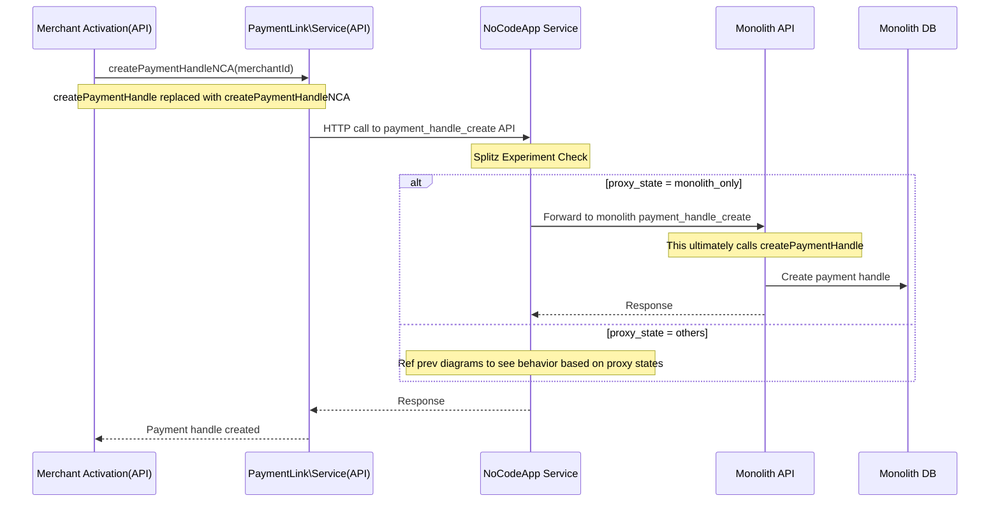
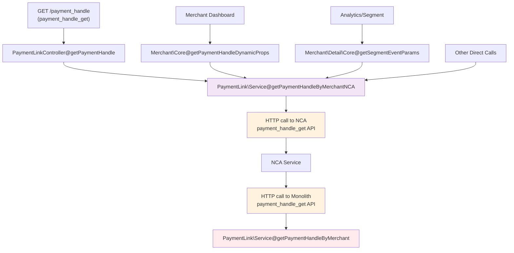

# Overview
This document outlines the decomposition of payment handle functionality from the monolithic API service to the NoCodeApp (NCA) service, including current patterns, migration flows, and implementation tasks.

# Current Write Patterns

## APIs

### Active APIs

**Dedicated Payment Handle APIs:**
- **`payment_handle_create`** - `POST /payment_handle`
- **`payment_handle_update`** - `PATCH /payment_handle`

**APIs based on view_type parameter:**
- **`payment_page_create_order`** - `POST /payment_pages/{id}/order`

**Note**: Deprecated APIs with 0 traffic (excluded from diagrams): `payment_handle_update_old` (`PATCH /payment_handle/{id}`), `payment_handle_precreate` (`POST /precreate_payment_handle`)

## Function Calls

### Active Function Calls
- **`PaymentLink\Service@createPaymentHandle`**
  - Used in merchant activation flows
  - Called from: `app/Models/Merchant/Activate.php` (lines 223, 383)
  - Context: Creates payment handles during merchant activation and instant activation

**Note**: Deprecated function call with minimal usage: `PaymentLink\Service@createPaymentHandle` from PaymentPageProcessor (background job processing)

# Current Read Patterns

## APIs

### Active APIs

**Dedicated Payment Handle APIs:**
- **`payment_handle_availability`** - `GET /payment_handle/{slug}/exists` (Called during onboarding)
- **`payment_handle_get`** - `GET /payment_handle` (Called after clicking on rzp.me link in Merchant Dashboard's sidebar)
- **`payment_handle_suggestion`** - `GET /payment_handle/suggestion` (Called during onboarding)
- **`payment_handle_amount_encryption`** - `POST /payment_handle/custom_amount` (Called on clicking Share from Merchant Dashboard)

**APIs based on ID:**
- **`pages_view_by_slug`** - `GET /pages/{slug}` (Customer's view)
- **`payment_page_get_details`** (from dashboard)
- **`payment_page_get`** (not called but should maintain the same behavior)

**APIs with no changes needed:**
- **`orders/{order_id}/product_details`** - Not supported currently for handles, no edits needed
- **`payment_page_expire_cron`** - No major changes needed, just ensure handles aren't expired


# Merchant Settings APIs

**APIs to be migrated:**
- **`payment_page_set_merchant_details`**
- **`payment_page_fetch_merchant_details`**

These APIs only edit and fetch the 80g details, the handle related keys are used by the handle APIs only.

**Current Settings Usage Analysis:**
```sql
select key, count(*) as count from realtime_hudi_api.settings
where module='payment_link' and entity_type='merchant' and created_date>='2025-01-01'
group by key order by count desc;
```

**Payment Link Module Settings (4 keys total):**

| Setting Key | Count | Usage |
|-------------|-------|-------|
| `default_payment_handle.default_payment_handle_page_id` | 232,923 | Payment handles |
| `default_payment_handle.default_payment_handle` | 232,909 | Payment handles |
| `text_80g_12a` | 644 | Payment pages (80G details) |
| `image_url_80g` | 644 | Payment pages (80G details) |

**Migration Strategy:**
- **80G details**: Used by payment pages data will be migrated to NCA configs table and `payment_page_set_merchant_details` and `payment_page_fetch_merchant_details` must be moved to NCA.
- **Handle settings**: Move to NCA configs table along with handle migration
- **APIs migration**:


## Function Calls

### Active Function Calls

- **`\RZP\Models\PaymentLink\Core::getPaymentHandleByMerchant`**
  - Called from:
    - `\RZP\Models\PaymentLink\Service::getPaymentHandleByMerchant` (via `payment_handle_get` API)
    - `\RZP\Models\Merchant\Core::getPaymentHandleDynamicProps` (for merchant dashboard)
    - `\RZP\Models\Merchant\Detail\Core::getSegmentEventParams` (for analytics)

The dataflow and interaction between function calls is shown in the diagram below:



**Note**: No deprecated function calls identified for read patterns

# Request Flow during Migration

## Database Architecture & ID Reuse Pattern

The migration uses separate databases for Monolith and NCA services with a specific ID reuse strategy:

- **Monolith DB**: Existing database used by the monolith API
- **NCA DB**: New database used by NoCodeApp service
- **ID Reuse Pattern**:
  - **States `dual_write_no_reads_no_external` through `dual_write_read_no_external`**: Entities created in Monolith first, then NCA uses same IDs
  - **State `dual_write_read_external`**: Entities created in NCA first, then copied to Monolith with same IDs
  - **State `nca_only`**: Only NCA DB is used


## Request Flow - Write/Read APIs

**APIs covered by this flow:**

**Write APIs:**
- `payment_handle_create` - `POST /payment_handle`
- `payment_handle_update` - `PATCH /payment_handle`
- `payment_page_create_order` - `POST /payment_pages/{id}/order` (when view_type is handle)
- `payment_page_set_merchant_details` - For handle-related settings

**Read APIs:**
- `payment_handle_get` - `GET /payment_handle`
- `payment_handle_availability` - `GET /payment_handle/{slug}/exists`
- `payment_handle_suggestion` - `GET /payment_handle/suggestion`
- `payment_handle_amount_encryption` - `POST /payment_handle/custom_amount`
- `pages_view_by_slug` - `GET /pages/{slug}` (for payment handles)
- `payment_page_get_details` - For handle details from dashboard
- `payment_page_get` - Handle-related page data
- `payment_page_fetch_merchant_details` - For handle-related settings



## Request Flow - PaymentLink\Service@createPaymentHandle Function Calls



## Request Flow - \RZP\Models\PaymentLink\Core::getPaymentHandleByMerchant Function Calls

The request flow would be very similar to the above createPaymentHandle function call, except the API called would be `payment_handle_get` instead of `payment_handle_create`. The function `getPaymentHandleByMerchantNCA` would be used in place of `getPaymentHandleByMerchant`.

The dataflow and interaction between function calls is shown in the diagram below:




# Major Tasks

## NoCodeApp Service Implementation
### Basic Proxy Implementation
- Implement proxy logic for all payment handle APIs
- Initially proxy all requests to monolith

**New APIs to be served via NCA:**

**Dedicated Payment Handle APIs:**
- `payment_handle_create` - `POST /payment_handle`
- `payment_handle_update` - `PATCH /payment_handle`
- `payment_handle_availability` - `GET /payment_handle/{slug}/exists`
- `payment_handle_get` - `GET /payment_handle`
- `payment_handle_suggestion` - `GET /payment_handle/suggestion`
- `payment_handle_amount_encryption` - `POST /payment_handle/custom_amount`

**Merchant Settings APIs:**
- `payment_page_set_merchant_details`
- `payment_page_fetch_merchant_details`

**New Function Call APIs (created to replace monolith function calls):**
- `payment_handle_create_nca` - HTTP endpoint for `PaymentLink\Service@createPaymentHandleNCA`
- `payment_handle_get_nca` - HTTP endpoint for `PaymentLink\Core@getPaymentHandleByMerchantNCA`


## Function Call Replacements in Monolith
### Create Operations
- Replace `PaymentLink\Service@createPaymentHandle` with `PaymentLink\Service@createPaymentHandleNCA`
- Update calls in merchant activation flows (`app/Models/Merchant/Activate.php`)
- New function makes HTTP calls to NCA's `payment_handle_create` API

### Read Operations
- Replace `PaymentLink\Core::getPaymentHandleByMerchant` with `PaymentLink\Core::getPaymentHandleByMerchantNCA`
- Update calls from:
  - `PaymentLink\Service::getPaymentHandleByMerchant`
  - `Merchant\Core::getPaymentHandleDynamicProps`
  - `Merchant\Detail\Core::getSegmentEventParams`
- New function makes HTTP calls to NCA's `payment_handle_get` API

## Edge Changes
- **Routing Rules**: Update edge routing to direct payment handle APIs to NCA

**APIs to add routing at Edge:**
- `payment_handle_create`
- `payment_handle_update`
- `payment_handle_availability`
- `payment_handle_get`
- `payment_handle_suggestion`
- `payment_handle_amount_encryption`
- `payment_page_set_merchant_details`
- `payment_page_fetch_merchant_details`

- **Monitoring**: Set up monitoring and dashboards for the NCA routes at both edge and service level.

## API Implementation in NCA
- **Create APIs**:
  - `payment_handle_create` - Create new payment handles
  - `payment_handle_update` - Update existing payment handles

- **Read APIs**:
  - `payment_handle_get` - Get payment handle by merchant
  - `payment_handle_availability` - Check slug availability
  - `payment_handle_suggestion` - Generate handle suggestions
  - `payment_handle_amount_encryption` - Encrypt custom amounts
  - `pages_view_by_slug` - Serve hosted pages. Payment handle hosted page template needs to be migrated.

Checklist
- make sure payment notification API is configured for handles.

## Experiment Configuration

### Splitz Experiment Setup
- **Experiment Name**: `payment_handle_proxy_state`
- **Based on**: Clone of existing payment page experiment (`PpAafnXN2nt8GZ`)
- **Purpose**: Control proxy state for payment handle APIs

### Proxy State Logic by API Type

**Dedicated Payment Handle APIs:** - Direct call to `payment_page_proxy_state` experiment.
**View Type Parameter APIs:** - Check request view_type parameter first. If view_type is "handle", call `payment_page_proxy_state` experiment
**ID-based APIs:** - Fetch entity by ID from database and Check entity's view_type. If view_type is "handle", call `payment_page_proxy_state` experiment.

### Implementation Details
- **Diff Calculation**: Reuse existing diff calculation setup from payment pages
- **ID Management**:
  - Create operations: Reuse IDs from monolith response
  - Update operations: No ID reuse needed (only slug and merchant settings updates)
- **Dual Writes**: Implement reverse dual writes for all write APIs
- **Fallback**: Default to `monolith_only` state for any experiment failures

## Migration Phases

> **⚠️ Important Note**: The migration should not happen before the proxy state for handles have been properly setup.

### Data Migration Phase
- Create migration script to transfer merchant settings from monolith to NCA.
- Run data migration script during low-traffic hours

## Dual Writes Rollout

- **Phase 1: Write API Dual Writes** - 100% dual writes after NCA write APIs implementation, 2 days active bug fixes + 4 days wait period
- **Phase 2: Read API Shadowing** - 100% shadowing for read APIs, 2 days active bug fixes + 4 days wait period
- **Phase 3: NCA Read Migration** - 100% NCA reads, 2 days continuous monitoring
- **Phase 4: External Entity Migration** - 20% → 50% → 100% progressive rollout, 2 days monitoring each step
- **Phase 5: Complete Migration** - 20% → 50% → 100% NCA only, 2 days monitoring each step

## Rollback Strategies
- The proxy states are designed to be stacked on top of each other, so we can always fallback to the previous proxy state in case of issues. As we are doing extensive diff monitoring for long periods of time, there shouldn't be any issues in the first place.
