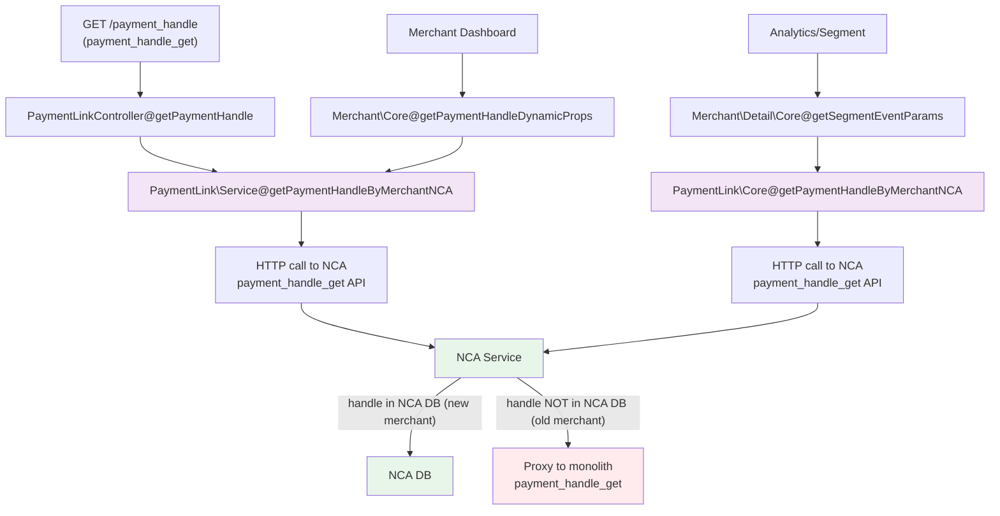
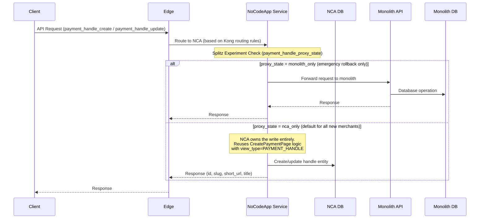
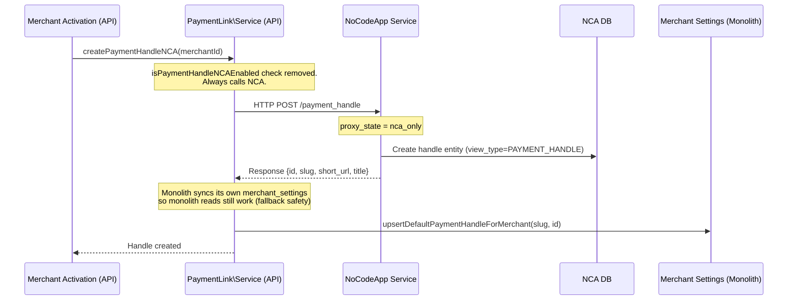
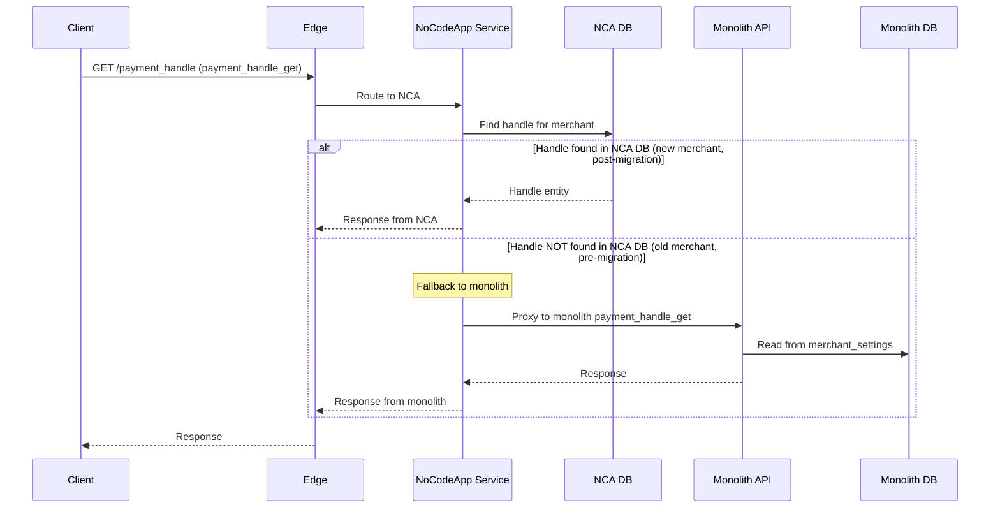
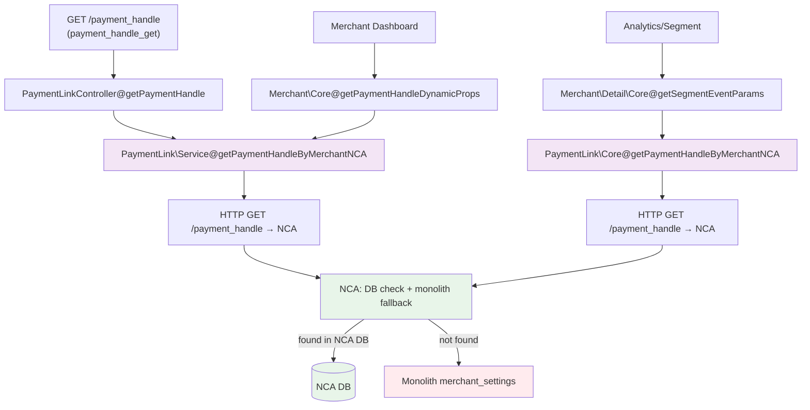

# Payment Handles API Decomposition Spec (v2)

**Author/s:**
**Team/Pod:** NocodeApps | BU: Payments

> **Note**: This is a revised version of the original spec (`PaymentHandleDecomp.md`). The core strategy has changed from dual-write to **NCA-direct writes for all new merchants from day 1**, with a read fallback to monolith until old merchant data is migrated.

---

# 1. Overview

This document outlines the plan for the decomposition of payment handle functionality from the API service to the NoCodeApp (NCA) service.

Since payment handles are a type of payment pages (same underlying entity, `view_type = PAYMENT_HANDLE`), NCA already has the full `CreatePaymentPage` implementation that can be reused directly for handles. The migration strategy here is deliberately simpler than payment pages:

**Core strategy:**
- All new merchants get their payment handles written directly to NCA from day 1 — no dual write, no proxy back to monolith.
- Old merchants' handles stay in monolith until a data migration is run.
- Reads use a "NCA-first, monolith fallback" pattern — NCA checks its own DB, and falls back to monolith for merchants whose data hasn't been migrated yet.

---

# 2. Write Patterns

Payment handle writes happen through two paths:

## 2.1. Writes through APIs

**Dedicated Payment Handle Write APIs:**
- `payment_handle_create` - `POST /payment_handle`
- `payment_handle_update` - `PATCH /payment_handle`

**APIs based on view_type parameter:**
- `payment_page_create_order` - `POST /payment_pages/{id}/order`

**Note**: Deprecated APIs with 0 traffic (excluded from scope): `payment_handle_update_old` (`PATCH /payment_handle/{id}`), `payment_handle_precreate` (`POST /precreate_payment_handle`)

## 2.2. Writes through Function Calls

- **`PaymentLink\Service@createPaymentHandle`**
  - Creates payment handles during merchant activation and instant activation
  - Called from: `app/Models/Merchant/Activate.php` (lines 223, 383)
  - Replaced with `PaymentLink\Service@createPaymentHandleNCA` (see Section 5.2)

**Note**: Deprecated function call: `PaymentLink\Service@createPaymentHandle` from PaymentPageProcessor (background job processing)

## 2.3. What Monolith Does During a Handle Write (Extra Handling)

When monolith creates a payment handle via `createPaymentHandle`, it does two things beyond a normal page create:

1. **Creates the payment page entity** with handle-specific defaults via `createPaymentPageForPaymentHandle`:
   - `view_type = PAYMENT_HANDLE`
   - `short_url = <paymentHandleHostedBaseUrl>/<slug>`
   - A single payment page item with `name = "amount"`, `currency = INR`, `mandatory = true`, `min_amount = 100`
   - UDF schema with a required "comment" field
   - title from merchant's billing label
   - Creates a custom URL entry (slug → page ID mapping)

2. **Writes to merchant settings** via `upsertDefaultPaymentHandleForMerchant(slug, pageId)`:
   - Writes `default_payment_handle.default_payment_handle = <slug>`
   - Writes `default_payment_handle.default_payment_handle_page_id = <pageId>`
   - This is the pointer that `getPaymentHandleByMerchant` reads to determine the "active handle" for the merchant

In the new approach, **NCA handles step 1** using the existing `CreatePaymentPage` function (same as `nca_only` for payment pages), and **monolith handles step 2** after the NCA call returns — see Section 5.2.

---

# 3. Read Patterns

## 3.1. Reads through APIs

**Dedicated Payment Handle APIs:**
- `payment_handle_availability` - `GET /payment_handle/{slug}/exists` (Called during onboarding)
- `payment_handle_get` - `GET /payment_handle` (Called after clicking on rzp.me link in Merchant Dashboard's sidebar)
- `payment_handle_suggestion` - `GET /payment_handle/suggestion` (Called during onboarding)
- `payment_handle_amount_encryption` - `POST /payment_handle/custom_amount` (Called on clicking Share from Merchant Dashboard)

**APIs based on ID:**
- `pages_view_by_slug/pages_view/payment_page_view_get` - `GET /pages/{slug}` (Customer's view)
- `payment_page_get_details` (from dashboard)
- `payment_page_get` (not called but should maintain the same behavior)

**APIs based on query params:**
- `payment_page_list` - `GET /payment_pages` (from merchant dashboard)

**APIs with no changes needed:**
- `orders/{order_id}/product_details` - Not supported currently for handles, no edits needed
- `payment_page_expire_cron` - No changes needed, just ensure handles aren't expired

## 3.2. Reads through Function Calls

- **`\RZP\Models\PaymentLink\Core::getPaymentHandleByMerchant`**
  - Called from:
    - `\RZP\Models\PaymentLink\Service::getPaymentHandleByMerchant` (via `payment_handle_get` API)
    - `\RZP\Models\Merchant\Core::getPaymentHandleDynamicProps` (for merchant dashboard)
    - `\RZP\Models\Merchant\Detail\Core::getSegmentEventParams` (for analytics)

The dataflow and interaction between function calls is shown in the diagram below:



## 3.3. What Monolith Does During a Handle Read (Extra Handling)

`getPaymentHandleByMerchant` in monolith does **not query the payment_link table**. It reads entirely from merchant settings:

```
merchantSettings['default_payment_handle']['default_payment_handle']          → slug
merchantSettings['default_payment_handle']['default_payment_handle_page_id']  → page ID
```

So the "active handle" for a merchant is determined solely by the merchant settings pointer. This is important for the migration:
- **New merchants** (data in NCA): NCA reads from its `payment_handles` table and returns the handle. Monolith merchant settings are also updated (see Section 5.2), so the old monolith path still works as a fallback.
- **Old merchants** (data only in monolith): NCA doesn't find a record in its DB → falls back to proxying monolith's `payment_handle_get` → monolith reads from merchant settings.

---

# 4. Merchant Settings APIs

**Current Settings Usage Analysis:**
```sql
select key, count(*) as count from realtime_hudi_api.settings
where module='payment_link' and entity_type='merchant' and created_date>='2025-01-01'
group by key order by count desc;
```

**Payment Link Module Settings (4 keys total):**

| Setting Key | Count | Usage |
|-------------|-------|-------|
| `default_payment_handle.default_payment_handle_page_id` | 232,923 | Payment handles |
| `default_payment_handle.default_payment_handle` | 232,909 | Payment handles |
| `text_80g_12a` | 644 | Payment pages (80G details) |
| `image_url_80g` | 644 | Payment pages (80G details) |

**APIs to be migrated:**
- `payment_page_set_merchant_details`
- `payment_page_fetch_merchant_details`

These APIs only edit and fetch the 80G details; the handle related keys are used by the payment handle APIs only.

**Migration Plan for these settings:**
- **80G details**: These settings will be migrated to NCA configs table and the APIs will be moved to NCA.
- **Handle settings (`default_payment_handle.*`)**: For new merchants, these are written by monolith after the NCA create call returns (see Section 5.2). For old merchants, they remain in monolith until data migration. NCA stores the same information natively in its `payment_handles` table.

---

# 5. Request Flow during Migration

## 5.1. Request Flow - Write APIs (NCA-direct, no dual write)

All new merchant writes go directly to NCA. There is no proxy back to monolith for writes. The experiment has only two states:
- `monolith_only` — emergency rollback valve. NCA proxies to monolith.
- `nca_only` — default for all new merchants. NCA writes directly.



## 5.2. Request Flow - createPaymentHandle Function Calls (from Monolith Activation)

The monolith activation flow calls NCA to create the handle. After NCA responds, monolith syncs its own `merchant_settings` so the monolith read path (`getPaymentHandleByMerchant`) continues to work as a fallback.



**Why monolith syncs merchant_settings (Option A vs B):**
- Monolith already has the response data and the `upsertDefaultPaymentHandleForMerchant` function.
- Keeps NCA decoupled from monolith internals — NCA should not need to call back into monolith to set settings.
- If the upsert fails, it can be retried locally in monolith; no distributed failure handling needed.
- Emergency rollback: if experiment is ever switched to `monolith_only`, merchant_settings already has the right data.

## 5.3. Request Flow - Read APIs (NCA-first, monolith fallback)



## 5.4. Request Flow - getPaymentHandleByMerchant Function Calls

The monolith function callers (`Merchant\Core`, `Merchant\Detail\Core`) now call NCA via `getPaymentHandleByMerchantNCA`. NCA handles the DB-or-fallback logic internally.



---

# 6. Major Tasks

## 6.1. NoCodeApp Service Implementation

### 6.1.1. Basic Proxy Implementation (Already Done)

Routes and controllers are already set up in NCA. Kong routing to NCA is already live (PR #8736). In `monolith_only` state all requests still proxy to monolith — no behavior change.

**APIs already routed via NCA:**
- `payment_handle_create` - `POST /payment_handle`
- `payment_handle_update` - `PATCH /payment_handle`
- `payment_handle_availability` - `GET /payment_handle/{slug}/exists`
- `payment_handle_get` - `GET /payment_handle`
- `payment_handle_suggestion` - `GET /payment_handle/suggestion`
- `payment_handle_amount_encryption` - `POST /payment_handle/custom_amount`

### 6.1.2. Function Calls to be Replaced with APIs in Monolith (Already Done)

- `PaymentLink\Service@createPaymentHandle` → `createPaymentHandleNCA` (PR #64786)
- `PaymentLink\Core@getPaymentHandleByMerchant` → `getPaymentHandleByMerchantNCA` (PR #64786)

**Remaining change in monolith (PR #64786 update):**
- After NCA create returns, call `upsertDefaultPaymentHandleForMerchant(slug, id)` to sync merchant_settings.
- Remove `isPaymentHandleNCAEnabled` Splitz gate for writes — always call NCA.

## 6.2. NCA Write Implementation (`payment_handle_create`, `payment_handle_update`)

### Create (`payment_handle_create`)

NCA reuses the existing `CreatePaymentPage` function with `view_type = PAYMENT_HANDLE`. This is the same function used in `nca_only` state for payment pages — no new write logic needs to be built from scratch.

**Handle-specific defaults that `CreatePaymentPage` input must carry:**

| Field | Value |
|-------|-------|
| `view_type` | `PAYMENT_HANDLE` |
| `title` | Merchant billing label (from `merchantDetails`) |
| `currency` | `INR` |
| `payment_page_items` | Single item: `name=amount`, `mandatory=true`, `min_amount=100` |
| `settings.udf_schema` | `[{"name":"comment","title":"Comment","required":true,"type":"string",...}]` |
| `slug` | From request input (or auto-generated from billing label if not provided) |
| `short_url` | `<paymentHandleHostedBaseUrl>/<slug>` |

**ID generation:** NCA generates its own ID (`GenerateAndSetId()`). No ID reuse from monolith needed since we are not dual writing.

**Controller change (PR #1006/#1007 update):**
- Remove `DualWriteHandlerForHandleWrites` entirely for the write path.
- `Create` handler directly calls `handleCore.CreatePaymentHandle(ctx, req)` — takes the request as input, not a monolith response.
- Similarly for `Update`.

### Update (`payment_handle_update`)

Update changes the slug and short_url of the existing handle entity in NCA DB. The page ID stays the same.

- Find handle entity by `merchant_id + mode`
- Update `slug`, `short_url`, `title` fields
- If entity not found (old merchant pre-migration): proxy to monolith as fallback (same pattern as reads)

## 6.3. NCA Read Implementation

### `payment_handle_get` (GET /payment_handle)

NCA-first with monolith fallback:

```
1. Query NCA DB: SELECT * FROM payment_handles WHERE merchant_id = ? AND mode = ?
2. If found → return NCA response
3. If not found → proxy to monolith payment_handle_get → return monolith response
```

### `payment_handle_availability` (GET /payment_handle/{slug}/exists)

Global slug uniqueness check. Check NCA DB for the slug. Also check monolith for old slugs (old merchants' slugs live in monolith's custom URL table until migration). During the migration transition period, proxy to monolith is safest.

Post full migration: NCA owns this entirely.

### `payment_handle_suggestion` (GET /payment_handle/suggestion)

Purely computational — generates slug suggestions based on merchant billing label. No stored data needed. NCA can implement this natively without any fallback.

### `payment_handle_amount_encryption` (POST /payment_handle/custom_amount)

Stateless encryption of a custom amount. NCA implements this natively. No stored data, no monolith fallback needed.

## 6.4. Experiment Configuration

### 6.4.1. Simplified Proxy States

The experiment (`payment_handle_proxy_state`) has only two states (no dual-write states):

| State | Write behavior | Read behavior |
|-------|---------------|---------------|
| `monolith_only` | NCA proxies all writes to monolith | NCA proxies all reads to monolith |
| `nca_only` | NCA writes directly to its DB | NCA reads from its DB; falls back to monolith if not found |

### 6.4.2. Proxy State by API Type

- **Dedicated Payment Handle Write APIs** (`create`, `update`): Use `payment_handle_proxy_state` experiment.
- **Dedicated Payment Handle Read APIs** (`get`, `availability`, `suggestion`, `amount_encryption`): Use `payment_handle_proxy_state` experiment for `get` and `availability`. `suggestion` and `amount_encryption` are NCA-native regardless.
- **View Type Parameter APIs** (`payment_page_create_order`): Check request `view_type`. If `view_type = PAYMENT_HANDLE`, use `payment_handle_proxy_state` experiment.
- **ID-based APIs**: Fetch entity by ID and check `view_type`. If handle, use `payment_handle_proxy_state`.

### 6.4.3. Implementation Notes

- **No ID reuse from monolith**: NCA generates its own IDs.
- **No diff calculation / dual write checker needed** for the write path (since we're not dual writing).
- **Diff checker still needed for reads during shadowing** — compare NCA response vs monolith response before cutting over.
- **Fallback**: Default to `monolith_only` state for any Splitz failures.

## 6.5. Edge Changes (Already Done)

Kong routing to NCA for all payment handle APIs is already set up (PR #8736). No further edge changes needed.

## 6.6. Migration Phases

> **⚠️ Important Note**: All writes for **new** merchants go to NCA from day 1 once `nca_only` is enabled. Old merchant data remains in monolith until the migration script runs.

### Phase 1: NCA Writes for New Merchants (Target: ASAP)

- Enable `nca_only` experiment for all new merchants (100% rollout from activation date).
- All new `payment_handle_create` and `payment_handle_update` calls write directly to NCA DB.
- Monolith still updates `merchant_settings` after NCA create response.
- Old merchants continue to use monolith (experiment stays `monolith_only` for them).
- Monitor: `PH_NCA_CREATE_SUCCESS` / error rates, handle create latency.

### Phase 2: Data Migration for Old Merchants

- Run migration script to copy existing handle data (merchant settings + `payment_link` entities) from monolith DB to NCA `payment_handles` table.
- Migration can be done in batches, low-traffic hours.
- After migration, switch experiment to `nca_only` for migrated merchants.

### Phase 3: Read Shadowing

- Enable shadowing for `payment_handle_get`: NCA calls both its DB and monolith, compares responses, returns monolith response.
- Run for 2-4 days, monitor diffs.
- Fix any response parity issues.

### Phase 4: Read Cutover

- NCA reads from its own DB for all merchants (post-migration).
- Monolith fallback only kicks in for any stragglers not yet migrated.
- Monitor for 3 days after full cutover.

### Phase 5: Full Decomp

- Remove monolith fallback from NCA read path.
- Decommission monolith payment handle code paths.

## 6.7. Rollback

- **Write rollback**: Switch experiment back to `monolith_only`. NCA proxies to monolith. Since monolith `merchant_settings` is kept in sync (Section 5.2), no data loss.
- **Read rollback**: Any point before Phase 4, switch back to proxying reads to monolith.
- **Data mismatch recovery**: Re-run migration script for affected merchants to re-sync NCA DB.

---

# 7. Monitoring & Observability

## 7.1 Monolith Trace Codes (prefix: `NCA_PAYMENT_HANDLE_`)

All new trace codes added in PR #64786. Search in Coralogix/Kibana with prefix `NCA_PAYMENT_HANDLE_`.

| Trace Code | Level | When | Action if seen |
|------------|-------|------|----------------|
| `NCA_PAYMENT_HANDLE_ENABLED_RESULT` | INFO | Splitz experiment evaluated for merchant | Normal — shows variant and enabled flag. Use to verify experiment rollout. |
| `NCA_PAYMENT_HANDLE_ENABLED_ERROR` | ERROR | Splitz call failed | Check Splitz service health. Falls back to monolith flow (safe). |
| `NCA_PAYMENT_HANDLE_CREATE_REQUEST` | INFO | NCA create flow initiated for merchant | Normal — confirms experiment enabled and NCA path entered. |
| `NCA_PAYMENT_HANDLE_CREATE_FAILED` | ERROR | NCA create call threw exception | Check NCA service health, logs. Monolith falls back to `createPaymentHandleV2` (safe). |
| `NCA_PAYMENT_HANDLE_EMPTY_RESPONSE` | ERROR | NCA returned empty data | NCA service issue. Monolith falls back (safe). |
| `NCA_PAYMENT_HANDLE_MISSING_SLUG_OR_ID` | ERROR | NCA response missing slug or ID | NCA response format issue. Monolith falls back (safe). |
| `NCA_PAYMENT_HANDLE_SERVICE_REQUEST` | INFO | HTTP call to NCA's `/v1/payment_handle/internal` | Normal — shows URL. |
| `NCA_PAYMENT_HANDLE_SERVICE_REQUEST_FAILED` | ERROR | HTTP call to NCA failed | Network/NCA down. Monolith falls back (safe). |

## 7.2 NCA Log Messages (search in NCA service logs)

| Log Message | Level | When | Action if seen |
|-------------|-------|------|----------------|
| `PH_CREATE_PROXYING_TO_MONOLITH` | INFO | External route, proxy state = monolith_only | Normal — request proxied to monolith. |
| `PH_NCA_CREATE_FAILED` | ERROR | CreatePaymentPage failed in NCA | Check NCA DB, merchant details API, Gimli. |
| `PH_NCA_CREATE_SUCCESS` | INFO | Payment handle created successfully | Normal. |
| `PH_NCA_CREATE_MERCHANT_SETTINGS_UPSERTED` | INFO | Merchant settings synced to monolith after create | Normal — confirms slug + page_id written. |
| `PH_NCA_CREATE_MERCHANT_SETTINGS_UPSERT_FAILED` | ERROR | Merchant settings sync failed | Check monolith's `setMerchantDetails` API. Handle was created in NCA but settings not synced — may need manual fix. |
| `PH_CREATE_HANDLE_ALREADY_EXISTS` | INFO | Duplicate create blocked | Normal — merchant already has a handle. |
| `PH_CREATE_FETCH_SETTINGS_FAILED` | ERROR | Failed to fetch merchant settings from monolith | Check monolith API health. Create proceeds anyway (non-blocking). |
| `PH_UPDATE_PROXYING_TO_MONOLITH` | INFO | Update proxied to monolith | Normal. |
| `PH_NCA_UPDATE_SUCCESS` | INFO | Update succeeded in NCA | Normal. |
| `PH_NCA_UPDATE_FAILED` | ERROR | Update failed in NCA | Check NCA DB. |

## 7.3 Monolith Metrics

| Metric | Description |
|--------|-------------|
| `payment_handle_creation_request` | Total create requests (both NCA and monolith paths) |
| `payment_handle_creation_successful_count` | Successful creates (NCA or monolith fallback) |
| `payment_handle_creation_failed_count` | Failed creates |
| `payment_handle_creation_time_taken` | Latency histogram |

## 7.4 Key Dashboards / Alerts to Set Up

- **NCA create success rate**: `PH_NCA_CREATE_SUCCESS` / (`PH_NCA_CREATE_SUCCESS` + `PH_NCA_CREATE_FAILED`) — alert if < 99%
- **Merchant settings sync failures**: `PH_NCA_CREATE_MERCHANT_SETTINGS_UPSERT_FAILED` count — alert if > 0 sustained for 5 min
- **Experiment rollout verification**: `NCA_PAYMENT_HANDLE_ENABLED_RESULT` with `enabled=true` count — should match expected rollout %
- **Monolith fallback rate**: `NCA_PAYMENT_HANDLE_CREATE_FAILED` / `NCA_PAYMENT_HANDLE_CREATE_REQUEST` — alert if > 5% (too many fallbacks)

---

# 8. PR Mapping

| PR | Repo | Change |
|----|------|--------|
| [#8736](https://github.com/razorpay/terraform-kong/pull/8736) | terraform-kong | Kong routing — **already done, no changes needed** |
| [#64786](https://github.com/razorpay/api/pull/64786) | api (monolith) | Add `upsertDefaultPaymentHandleForMerchant` call after NCA create response; remove Splitz gate for writes |
| [#1006](https://github.com/razorpay/no-code-apps/pull/1006) | no-code-apps | Remove `DualWriteHandlerForHandleWrites`; simplify experiment to `monolith_only`/`nca_only` only |
| [#1007](https://github.com/razorpay/no-code-apps/pull/1007) | no-code-apps | Rewrite `CreatePaymentHandle` to take request input (not monolith response); use `CreatePaymentPage` with handle defaults |
| [#1008](https://github.com/razorpay/no-code-apps/pull/1008) | no-code-apps | Implement NCA-first read with monolith fallback for `payment_handle_get`; implement `suggestion` and `amount_encryption` natively |
| [#1021](https://github.com/razorpay/no-code-apps/pull/1021) | no-code-apps | NCA-direct writes: payment handle defaults from billing label, merchant settings read/write, handle-specific validations, proxy routes |
| [#9102](https://github.com/razorpay/terraform-kong/pull/9102) | terraform-kong | Route payment_handle_create and payment_handle_update to NCA via upstream-override |
