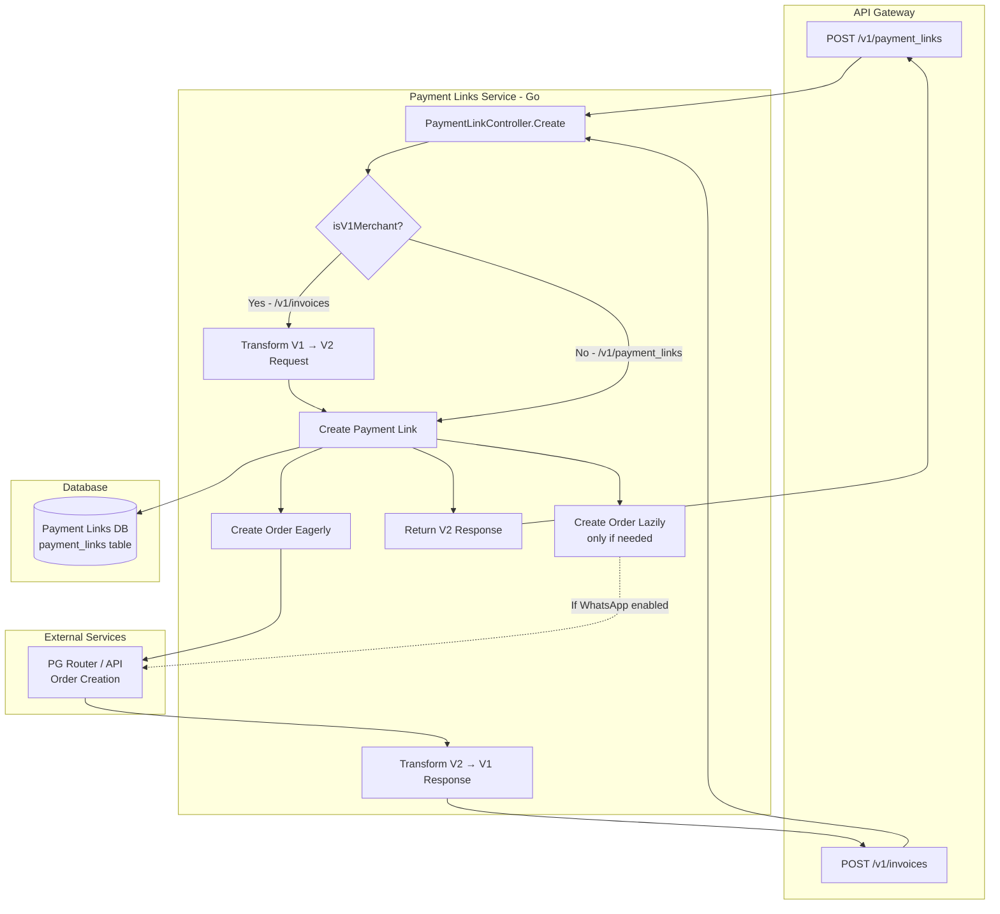
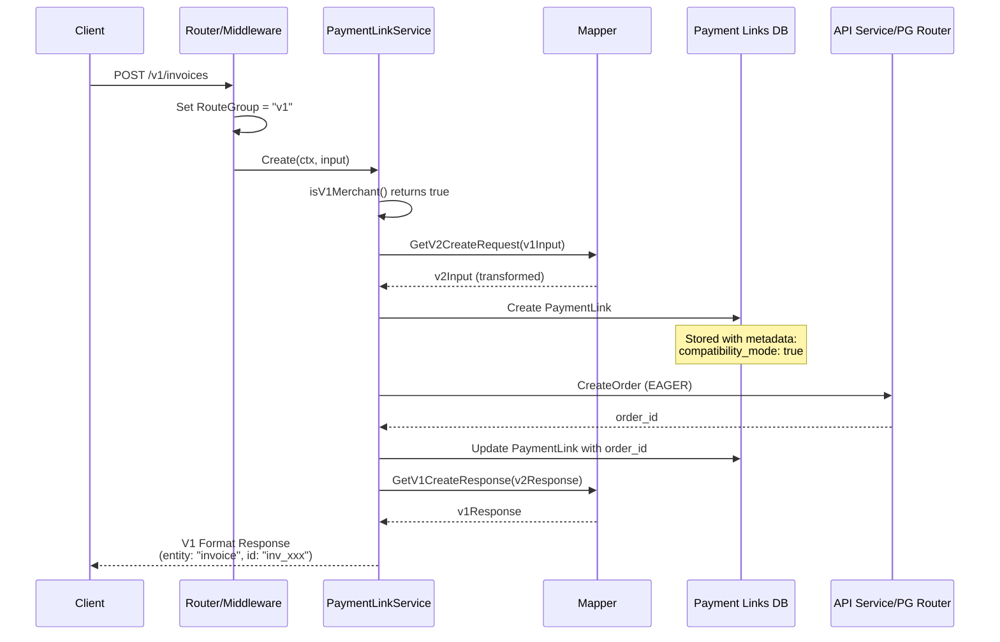
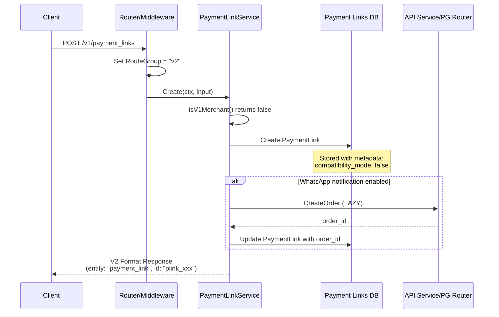
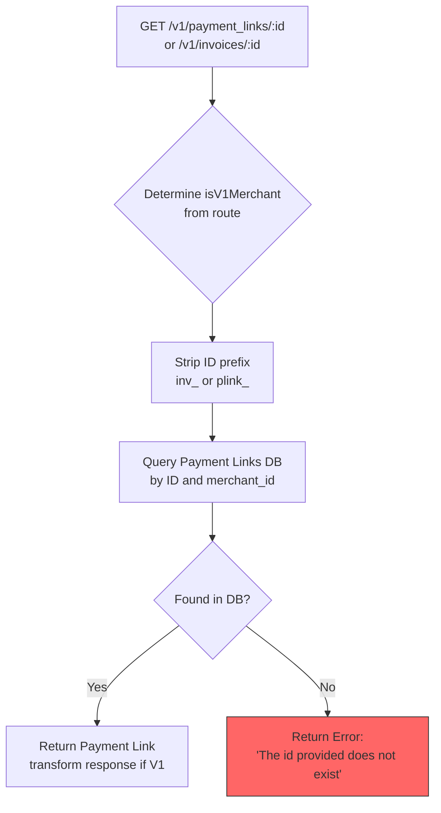
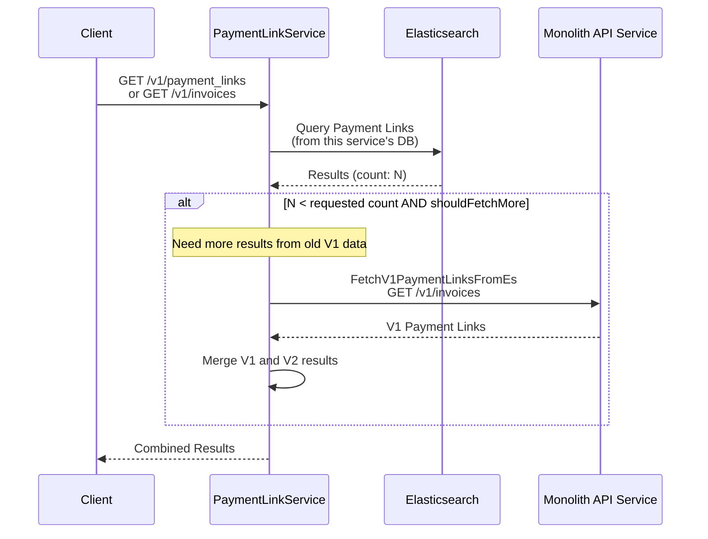
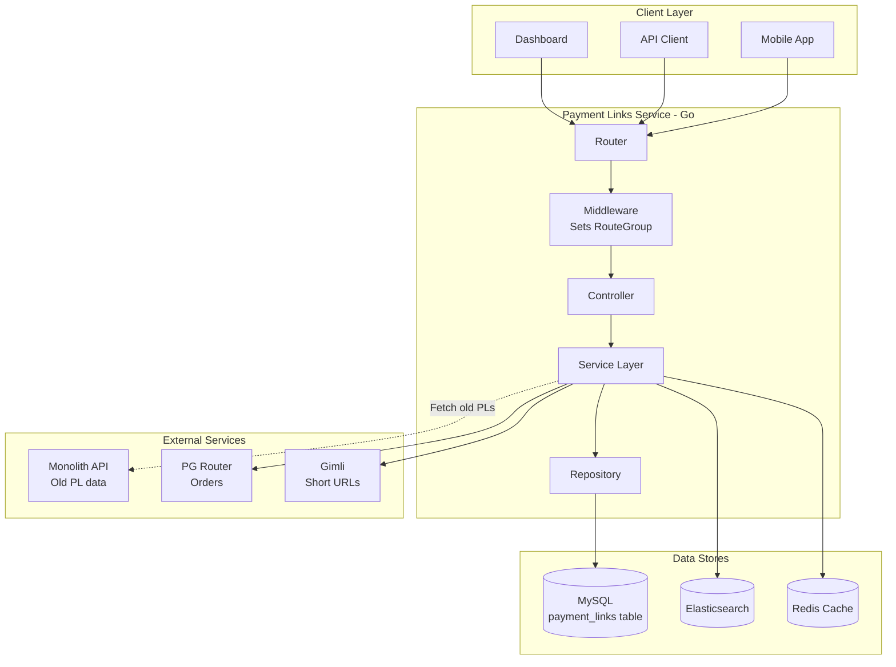

# Payment Links V1 vs V2 Flow Analysis

## Overview

This document explains the differences between V1 and V2 payment link flows in the Payment Links service.

> **Historical Context:** "Invoices" was the old name for payment links in the monolith (API service). The `/v1/invoices` endpoint still exists for backward compatibility with merchants using the legacy API contract.

## Key Terminology

| Term | Description |
|------|-------------|
| **V1 Merchant** | A merchant using the legacy `/v1/invoices` API contract |
| **V2 Merchant** | A merchant using the new `/v1/payment_links` API contract |
| **Monolith (API Service)** | The original PHP/Laravel API service where payment links were first implemented |
| **Payment Links Service** | This Go microservice that now handles all payment link operations |

---

## Route-based V1/V2 Determination

The system determines whether a request is V1 or V2 based on the **route prefix** used:

```
28:88:internal/services/decision.go
// Refer decision matrix : https://docs.google.com/spreadsheets/d/1heVQGY1oj6bUyE-qtZLMrOf3C2zcn70oTRgJMKNmdLg/edit#gid=625484968
// Update: First check the route used while creating PL, decide depending on that. If /invoices -> V1Merchant, else if /payment-links -> V2Merchant.
func isV1Merchant(ctx *gin.Context, mc cache.IMerchantCache, paymentLink payment_link.PaymentLink, ignoreRouteGroup bool) (bool, error) {
    routeGroup := setRouteGroup(ctx)
    // ... First check with respect to routeGroups
    if routeGroup == constants.V1 {
        return true, nil
    } else if routeGroup == constants.V2 {
        return false, nil
    }
    // ... fallback to compatibility_mode in metadata
}
```

### Route Mapping

| Route Prefix | Route Group | Merchant Type |
|--------------|-------------|---------------|
| `/v1/invoices` | V1 | V1 Merchant |
| `/v1/invoices-count` | V1 | V1 Merchant |
| `/v1/payment_links` | V2 | V2 Merchant |

```
104:111:internal/constants/constants.go
const (
    RouteGroup           = "routeGroup"
    PlV2RouteGroupPrefix = "/v1/payment_links"
)

var (
    PlV1RouteGroupPrefixes = []string{"/v1/invoices", "/v1/invoices-count"}
    PlV1Routes             = []string{"/next_run/invoice/:id"}
)
```

---

## Database Architecture

### Critical Point: Same Database for Both Routes

**Both `/v1/payment_links` (V2) and `/v1/invoices` (V1) routes create payment links in the SAME database** - the Payment Links Service database (this Go service).

The monolith is **NOT** called during creation. The difference is purely in:
1. API contract (request/response format)
2. Order creation timing (eager vs lazy)
3. Response format transformation



---

## Create Flow Deep Dive

### V1 Merchant Flow (via `/v1/invoices`)



**Key Differences for V1:**

1. **Request Transformation** - V1 field names are mapped to V2:

```
15:152:internal/mapper/payment_link_v1_request.go
func GetV2CreateRequest(v1 map[string]interface{}) map[string]interface{} {
    v2 := make(map[string]interface{})
    // v1["amount"] → v2["amount"]
    // v1["receipt"] → v2["reference_id"]
    // v1["sms_notify"] → v2["notify"]["sms"]
    // v1["email_notify"] → v2["notify"]["email"]
    // v1["partial_payment"] → v2["accept_partial"]
    // ... etc
}
```

2. **Eager Order Creation** - Order is created immediately:

```
805:828:internal/services/service.go
// Create orders only for v1 merchants and whose source is not batch
if isV1Merchant && paymentLink.IsSourceBatch() == false {
    // V1 merchants expect order ID in response when creating PL
    orderId, oerr := createOrderAndSetForPL(ctx, paymentLink, options, Dependencies{
        ApiSvc:        service.services.GetApi(),
        PgRouterSvc:   service.services.GetPgRouter(),
        // ...
    })
    // assign order_id to link
    paymentLink.OrderId = orderId
}
```

3. **Response Transformation** - V2 response is converted to V1 format:

```
8:192:internal/mapper/payment_link_v1_response.go
func GetV1CreateResponse(v2 map[string]interface{}) map[string]interface{} {
    v1 := make(map[string]interface{})
    v1["entity"] = "invoice"           // V1 entity name
    v1["id"] = v2["id"]                // prefixed with "inv_"
    v1["receipt"] = v2["reference_id"]
    v1["partial_payment"] = v2["accept_partial"]
    // ... extensive field mapping
}
```

4. **ID Prefix** - Payment link ID is prefixed with `inv_`:

```
213:222:internal/payment_link/model.go
func (link *PaymentLink) GetSignedId(isV1Merchant bool) string {
    if isV1Merchant {
        return V1_ENTITY_PREIFX + link.ID  // "inv_" + ID
    }
    return ENTITY_PREIFX + link.ID         // "plink_" + ID
}
```

### V2 Merchant Flow (via `/v1/payment_links`)



**Key Differences for V2:**

1. **No Request Transformation** - Input is used directly
2. **Lazy Order Creation** - Order only created when needed (e.g., WhatsApp notification)
3. **Native Response Format** - No transformation needed
4. **ID Prefix** - Payment link ID is prefixed with `plink_`

---

## GET Flow (Single Payment Link)

### How ID Lookup Works



**Important:** The GET flow does **NOT** call the monolith. If the payment link ID is not found in the Payment Links Service database, an error is returned.

```
1998:2007:internal/services/core.go
// this func checks if the given ID is present in the DB or not. If not, then it probably belongs to API DB.
func isV1RequestId(id, merchantId, mode string, plRepo payment_link.IPaymentLinkRepository) (bool, payment_link.PaymentLink) {
    link, _ := plRepo.GetByIdAndMerchantIdFromReplica(id, merchantId, mode)
    if link.ID == "" {
        metrics.V1V2Merchant("v1")
        return true, link  // ID not found, but we DON'T call monolith
    }
    metrics.V1V2Merchant("v2")
    return false, link
}
```

```
249:256:internal/services/service.go
isV1RequestId, paymentLink := isV1RequestId(id, merchantId, mode, service.plRepo)
// check for ID in PL V2 DB, if not found fetch for API and return result

if isV1RequestId {
    return nil, rzperror.NewRzpError(rzperror.CodeBadRequest, errors.New(rzperror.ErrorIdNotFound))
}
```

---

## FETCH Flow (List Payment Links) - **Monolith Called Here**

The FETCH (list) flow is where the monolith IS called for backward compatibility.



### Monolith API Call

```
248:278:pkg/services/api/impl.go
// Old PL Routes
const (
    GetPaymentLinkV1ById            = "/v1/invoices/%s"
    FetchPaymentLinkV1FromEs        = "/v1/invoices"
    CancelPaymentLinkV1ById         = "/v1/invoices/%s/cancel"
    ExpirePaymentLinkV1ById         = "/v1/invoices/%s/expire"
    // ...
)

func (service ApiService) FetchV1PaymentLinksFromEs(ctx *gin.Context, merchantId, mode string, queryParams map[string]interface{}) (map[string]interface{}, rzperror.IError) {
    url := FetchPaymentLinkV1FromEs + "?"
    // ... build query params
    return service.sendRequestToApi(ctx, nil, merchantId, mode, http2.MethodGet, url, "FetchV1PaymentLinksFromEs")
}
```

### Fetch Logic in Service

```
1421:1482:internal/services/service.go
var v1Items map[string]interface{}
// checks if merchant is old and number of items did not match the needed count
if items < count && shouldFetchMore {
    // these many items need to be fetched from V1
    pending := count - items
    
    v1Request := map[string]interface{}{
        "skip":  skipped,
        "count": pending,
    }
    
    // Call monolith API to get old payment links
    v1, rerr := service.services.GetApi().FetchV1PaymentLinksFromEs(ctx, merchantId, mode, v1Request)
    if rerr != nil {
        return nil, rerr
    }
    v1Items = v1
}

if isV1Merchant {
    // transform the v2 items to v1 format
    v2ItemsAsV1 := mapper.GetV1FetchResponses(fetchResponse)
    // perform in-memory merge
    final := mergeV1Responses(v1Items, v2ItemsAsV1)
    return final, nil
} else {
    // transform the v1 items to v2 format
    v1ItemsAsV2 := mapper.GetV2FetchResponses(v1Items)
    // perform in-memory merge
    final := mergeV2Responses(fetchResponse, v1ItemsAsV2)
    return final, nil
}
```

---

## Compatibility Mode in Metadata

When a payment link is created via `/v1/invoices`, `compatibility_mode: true` is stored in the metadata. This is used later to determine how to handle the payment link.

```
88:93:internal/payment_link/model.go
type MetadataStruct struct {
    CompatabilityMode *bool `json:"compatibility_mode,omitempty"`
    WAPLApplicable    *bool `json:"wapl_applicable,omitempty"`
}
```

```
428:438:internal/payment_link/model.go
func IsCompatibilityMode(paymentLink PaymentLink) bool {
    metaDataMap, _ := utils.ConvertItemToStringMap(paymentLink.MetaData)
    if val, ok := metaDataMap[AttributeCompatibilityMode]; ok && val != nil {
        vv := fmt.Sprintf("%v", val)
        if vv == "true" {
            return true
        }
    }
    return false
}
```

---

## Summary of Behavioral Differences

| Aspect | V1 (`/v1/invoices`) | V2 (`/v1/payment_links`) |
|--------|---------------------|--------------------------|
| **Database** | Payment Links Service DB | Payment Links Service DB |
| **Monolith Called on Create** | ❌ No | ❌ No |
| **Order Creation** | Eager (immediate) | Lazy (on-demand) |
| **ID Prefix** | `inv_` | `plink_` |
| **Entity Name** | `invoice` | `payment_link` |
| **Request Transformation** | V1 → V2 | None |
| **Response Transformation** | V2 → V1 | None |
| **Metadata Flag** | `compatibility_mode: true` | `compatibility_mode: false` |
| **Default SMS Notify** | `true` | `false` |
| **Default Email Notify** | `true` | `false` |

---

## When is the Monolith Actually Called?

| Operation | Monolith Called? | Details |
|-----------|------------------|---------|
| **Create** | ❌ No | PL created in this service's DB |
| **Get by ID** | ❌ No | Returns error if not found in this DB |
| **Fetch (List)** | ✅ Yes | To get OLD payment links created before migration |
| **Cancel/Expire** | ❌ No (for new PLs) | Only this service's DB is updated |
| **Update** | ❌ No | Only this service's DB is updated |

The monolith is only called in the **Fetch flow** to retrieve payment links that were created in the old system before the Payment Links Service existed. These old payment links still reside in the monolith's database.

---

## Architecture Diagram



---

## Request/Response Field Mapping Reference

### V1 to V2 Request Mapping

| V1 Field | V2 Field |
|----------|----------|
| `amount` | `amount` |
| `description` | `description` |
| `currency` | `currency` (default: INR) |
| `receipt` | `reference_id` |
| `reminder_enable` | `reminder_enable` |
| `sms_notify` | `notify.sms` |
| `email_notify` | `notify.email` |
| `expire_by` | `expire_by` |
| `callback_url` | `callback_url` |
| `callback_method` | `callback_method` |
| `customer_id` | `customer_id` |
| `customer` | `customer` |
| `notes` | `notes` |
| `partial_payment` | `accept_partial` |
| `first_payment_min_amount` | `first_min_partial_amount` |
| `options` | `options` |

### V2 to V1 Response Mapping

| V2 Field | V1 Field |
|----------|----------|
| `id` | `id` (with `inv_` prefix) |
| `entity` = `payment_link` | `entity` = `invoice` |
| `amount` | `amount`, `gross_amount` |
| `amount_paid` | `amount_paid` |
| `currency` | `currency` |
| `status` | `status` (mapped: created→issued, etc.) |
| `description` | `description` |
| `reference_id` | `receipt` |
| `customer` | `customer_details` |
| `notify.sms` | `sms_status` |
| `notify.email` | `email_status` |
| `accept_partial` | `partial_payment` |
| `first_min_partial_amount` | `first_payment_min_amount` |
| `short_url` | `short_url` |
| `order_id` | `order_id` |
| `payments` | `payments` (restructured) |

