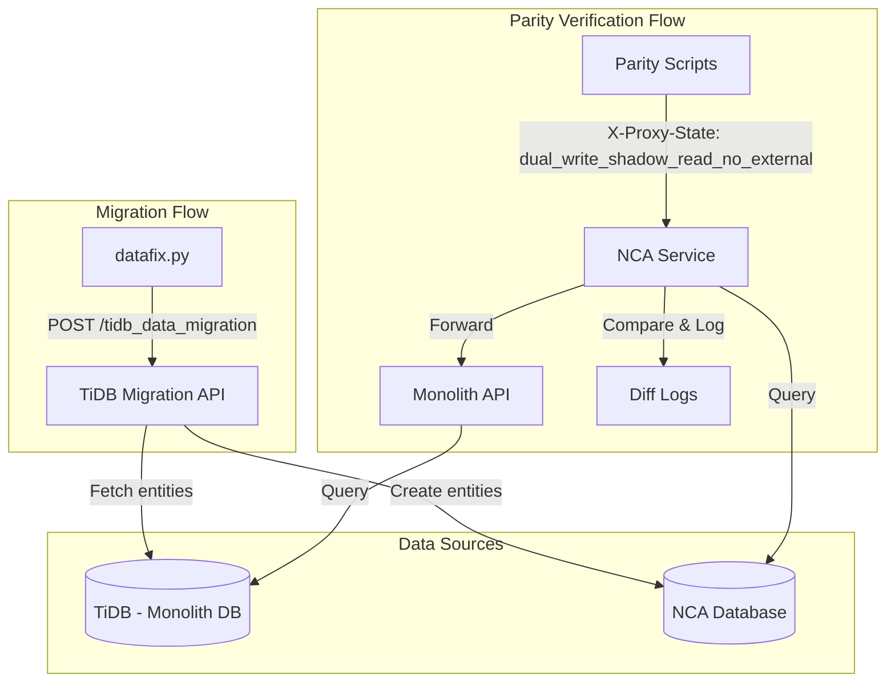
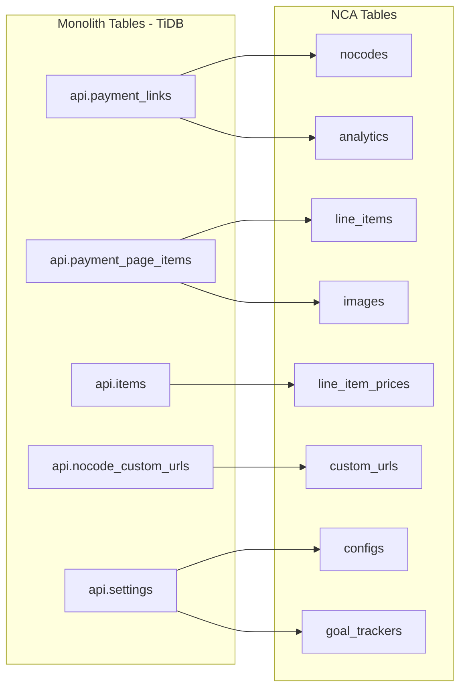

# Data Migration Scripts Guide

This document provides a comprehensive guide to the Payment Pages data migration and parity checking scripts used in the decomposition project.

---

## Overview

The migration process involves:
1. **Data Migration** - Copying payment page data from TiDB (monolith) to NCA database
2. **Parity Verification** - Comparing API responses between monolith and NCA to ensure data integrity

---

## Scripts Summary

| Script | Location | Purpose | Input Format | API Called |
|--------|----------|---------|--------------|------------|
| `datafix.py` | `/pythonscripts/decomp-scripts/migration/` | Migrate data from TiDB to NCA | CSV with pl_ids | `POST /v1/payment_pages/tidb_data_migration` |
| `parity_checker.py` | `/pythonscripts/decomp-scripts/parity/` | Check dashboard API parity | CSV: merchant_id, pl_id | `GET /v1/payment_pages/{id}/details` |
| `parity_hosted.py` | `/pythonscripts/decomp-scripts/parity_hosted/` | Check hosted page parity | CSV: merchant_id, pl_id | `GET /v1/pages/{id}/view` |
| `parity_list.py` | `/pythonscripts/decomp-scripts/parity_list/` | Check list API parity | CSV: merchant_id | `GET /v1/payment_pages` |
| `filter.py` | `/pythonscripts/decomp-scripts/parity/` | Remove response columns from output | parity_output.csv | N/A |
| `ignore.py` | `/pythonscripts/decomp-scripts/parity/` | Filter known acceptable diffs | filtered_parity_output.csv | N/A |

---

## Data Flow Architecture



---

## Migration Script: `datafix.py`

### Purpose

Migrates payment page data from TiDB (monolith database) to NCA database by calling the TiDB data migration API.

### Location

`/pythonscripts/decomp-scripts/migration/datafix.py`

### Input Format

**File:** `input_datafix.csv`

```csv
pl_DJL5r9OWIfaGWx
pl_ABC123def456
pl_XYZ789ghi012
```

- One payment link ID per line
- Must be prefixed with `pl_`
- Script strips the prefix before API call

### API Called

**Endpoint:** `POST https://nca-dark-concierge.razorpay.com/v1/payment_pages/tidb_data_migration`

**Request Body:**
```json
{
  "payment_link_ids": ["DJL5r9OWIfaGWx", "ABC123def456", ...]
}
```

**Authentication:** Basic Auth (credentials in script)

### Processing

1. Reads pl_ids from CSV
2. Strips `pl_` prefix from each ID
3. Batches IDs (100 per request)
4. Sends POST request to migration API
5. Writes results to `output_datafix.csv`
6. Shows progress bar with ETA

### Output Format

**File:** `output_datafix.csv`

| Column | Description |
|--------|-------------|
| payment_link_ids | Batch of IDs processed |
| status | `success` or `failed` |
| response | API response text |

### API Implementation

**Route:** `/v1/payment_pages/tidb_data_migration` (defined in `cron_routes.go`)

**Controller:** `PaymentPageController.TiDbDataMigration`

**Core Logic:** `PaymentPageCore.TiDbDataMigration` in `/no-code-apps-datafixes/internal/modules/payment_page/tidb_data_migration.go`

---

## Entities Migrated

The TiDB migration API fetches and creates the following entities:



### Entity Mapping

| Monolith Table | NCA Entity | Notes |
|----------------|------------|-------|
| `api.payment_links` | `nocodes` | Main payment page entity |
| `api.payment_page_items` | `line_items` | Items on the payment page |
| `api.items` | `line_item_prices` | Pricing for line items |
| `api.nocode_custom_urls` | `custom_urls` | Custom slugs/URLs |
| `api.settings` (PL) | `configs` | Payment link settings |
| `api.settings` (PPI) | `configs` | Payment page item settings |
| `api.settings` (goal_tracker) | `goal_trackers` | Goal tracking configuration |
| Derived from PL | `analytics` | Page analytics data |
| Derived from PPI | `images` | Item images |

### Query Limits

| Table | Limit | Notes |
|-------|-------|-------|
| payment_links | 500 per batch | `DataMigrationPLsLimit` |
| Other entities | 10,000 | `QueryLimit` |
| Settings | 20,000 | `SettingsQueryLimit` |

### Migration Process

1. **Fetch payment_links** by IDs from TiDB
2. **Fetch payment_page_items** for those payment_links
3. **Fetch items** for those payment_page_items
4. **Fetch nocode_custom_urls** for those payment_links
5. **Fetch settings** for payment_links and payment_page_items
6. **Transform** monolith entities to NCA format
7. **Delete existing** entities in NCA (if `deleteExistingEntities=true`)
8. **Bulk create** all new entities in a transaction

---

## Parity Scripts

### Common Headers

All parity scripts use these headers:

```python
headers = {
    'X-Razorpay-Merchant-Id': merchant_id,
    'X-Razorpay-Mode': 'live',
    'X-Proxy-State': 'dual_write_shadow_read_no_external',
    'Content-Type': 'application/json',
    'Authorization': 'Basic <credentials>',
}
```

### X-Proxy-State Explained

The `dual_write_shadow_read_no_external` proxy state enables:

1. **Request forwarded to monolith** - Gets monolith response
2. **Request processed in NCA** - Gets NCA response
3. **Responses compared** - Diffs logged
4. **Monolith response returned** - NCA response is "shadow"

This allows verifying NCA returns the same data without affecting production.

---

## Parity Checker: `parity_checker.py`

### Purpose

Verifies the dashboard `GET /v1/payment_pages/{id}/details` API returns consistent data.

### Location

`/pythonscripts/decomp-scripts/parity/parity_checker.py`

### Input Format

**File:** `parity_input.csv`

```csv
merchant_id,payment_link_id
MnDoR6P3iROwIE,QAzqd5p4TJB61U
MnDoR6P3iROwIE,PujdyoMN8ZH4lN
```

- Header row required
- `payment_link_id` without `pl_` prefix
- Script adds `pl_` prefix for API call

### API Called

**Endpoint:** `GET https://nca-dark-concierge.razorpay.com/v1/payment_pages/{pl_id}/details`

### Output

**File:** `parity_output.csv`

| Column | Description |
|--------|-------------|
| merchant_id | Merchant identifier |
| paymentlink_id | Payment link ID (with pl_ prefix) |
| diff_paths | Paths where diffs found |
| diffs | Actual diff content |
| diffs_present | Boolean indicating diffs exist |
| error | Error message if request failed |

**Error File:** `error.csv` - Contains rows that failed to write

### Concurrency

- Uses `ThreadPoolExecutor` with 10 workers
- Processes requests in parallel
- Results written asynchronously via writer thread

---

## Hosted Parity: `parity_hosted.py`

### Purpose

Verifies the hosted page view `GET /v1/pages/{id}/view` API (customer-facing checkout page).

### Location

`/pythonscripts/decomp-scripts/parity_hosted/parity_hosted.py`

### Input Format

**File:** `parity_hosted_input.csv`

```csv
payment_link_id,merchant_id
QAzqd5p4TJB61U,OhyLqzO26SbZ1m
PujdyoMN8ZH4lN,OhyLqzO26SbZ1m
```

### API Called

**Endpoint:** `GET https://nca-dark-concierge.razorpay.com/v1/pages/{pl_id}/view?skip_cache=true`

- Uses `skip_cache=true` to ensure fresh data (not from Redis cache)
- No Authorization header (public endpoint)

### Output

**File:** `parity_hosted_output.csv`

Same format as parity_checker but without `diff_paths` column.

---

## List Parity: `parity_list.py`

### Purpose

Verifies the payment page list `GET /v1/payment_pages` API.

### Location

`/pythonscripts/decomp-scripts/parity_list/parity_list.py`

### Input Format

**File:** `parity_list_input.csv`

```csv
merchant_id
MnDoR6P3iROwIE
NJqWBEfd5A4qnr
Ef5qV5tlqhOwng
```

- Only merchant_id required
- One merchant per line

### API Called

**Endpoint:** `GET https://nca-dark-concierge.razorpay.com/v1/payment_pages?skip=0&count=25`

Returns first 25 payment pages for each merchant.

### Output

**File:** `parity_list_output.csv`

| Column | Description |
|--------|-------------|
| merchant_id | Merchant identifier |
| diff_paths | Paths where diffs found |
| diffs | Actual diff content |
| diffs_present | Boolean indicating diffs exist |
| error | Error message if request failed |

---

## Helper Scripts

### Filter Script: `filter.py`

**Purpose:** Removes large response columns for easier analysis.

**Location:** `/pythonscripts/decomp-scripts/parity/filter.py`

**Removes columns:**
- `monolith_resp`
- `nca_resp`

**Input:** `parity_output.csv`
**Output:** `filtered_parity_output.csv`

### Ignore Script: `ignore.py`

**Purpose:** Filters out known acceptable diff paths.

**Location:** `/pythonscripts/decomp-scripts/parity/ignore.py`

**Ignored diff paths:**
```python
ignored_diffs = {
    '/captured_payments_count',      # Real-time count
    '/payment_page_items//quantity_sold',  # Real-time analytics
    '/payment_page_items//total_amount_paid',  # Real-time analytics
    '/total_amount_paid',            # Real-time analytics
    '/times_payable',                # Computed field
    '/description',                  # HTML encoding differences
    '/settings/udf_schema',          # Schema differences
}
```

**Input:** `filtered_parity_output.csv`
**Output:** `ignored_parity_output.csv`

---

## Target Merchants

### Location

`/pythonscripts/decomp-scripts/target_merchants.tsv`

### Format

Tab-separated file with columns:

| Column | Description |
|--------|-------------|
| mid | Merchant ID |
| recent_orders_count | Orders in recent period |
| total_orders | Total orders all time |
| total_pages | Number of payment pages |
| updated_page_orders | Orders on updated pages |
| updated_pages_count | Number of updated pages |

### Top 10 Merchants by Order Volume

| Rank | Merchant ID | Recent Orders | Total Pages |
|------|-------------|---------------|-------------|
| 1 | QedWZefco2y2EA | 56,897 | 50 |
| 2 | PrCuq0aEPFpu8z | 52,907 | 12 |
| 3 | RGzkFbQMhEVxhO | 51,470 | 16 |
| 4 | R7Y2Dervg5gGGU | 44,197 | 25 |
| 5 | QagXBwUNeuZFow | 44,148 | 32 |
| 6 | Qqv3ROJPJbRIte | 35,701 | 138 |
| 7 | OU49ID60OS699n | 31,111 | 8 |
| 8 | RFNMAWAYrA0hQD | 30,469 | 33 |
| 9 | Ha18e7jHMVjYEb | 26,451 | 9,479 |
| 10 | Qq82BbjBr05Puh | 24,646 | 19 |

---

## NCA API Implementations

### TiDB Data Migration API

**File:** `/no-code-apps-datafixes/internal/modules/payment_page/tidb_data_migration.go`

```go
func (c *PaymentPageCore) TiDbDataMigration(ctx context.Context, req *TiDbDataMigrationRequest) (map[string]interface{}, errors.IError) {
    // 1. Fetch entities from TiDB
    resp, err := c.getMonolithPaymentLinkEntitiesWithAssociationsFromTiDB(ctx, req)
    
    // 2. Create entities in NCA (with delete existing = true)
    err = c.createNewEntities(ctx, resp, true)
    
    return map[string]interface{}{
        "paymentLinksCount": len(resp),
    }, nil
}
```

### Payment Page Details API

**File:** `/no-code-apps-datafixes/internal/modules/payment_page/core.go`

```go
func (c *PaymentPageCore) GetPaymentPageDetails(ctx context.Context, paymentPageId string, res IPaymentPageResponseWithDetails, queryParams map[string][]string) errors.IError {
    // 1. Find entity with all associations
    err := c.noCodeModule.GetRepo().FindByIdAndMerchantIdAndModeWithAllAssociations(...)
    
    // 2. Transform to response
    if err := ToPaymentPageResponse(ctx, &paymentPageEntity, res); err != nil {
        return err
    }
    
    return nil
}
```

### Hosted Page View API

**File:** `/no-code-apps-datafixes/internal/modules/payment_page/core.go`

```go
func (c *PaymentPageCore) HostedPaymentPageView(ctx context.Context, paymentPageId string, requestBody map[string]interface{}, queryParams map[string][]string) (string, errors.IError) {
    // 1. Find entity
    err := c.noCodeModule.GetRepo().FindByIDWithAssociations(ctx, paymentPageEntity, paymentPageId)
    
    // 2. Check cache for payload
    hostedViewPayload := c.getHostedPayloadFromCache(ctx, paymentPageEntity)
    
    // 3. Build and render HTML
    return c.RenderTemplateWithPayload(ctx, templateName, *hostedViewPayload)
}
```

---

## Troubleshooting

### Migration Failures

| Error | Cause | Solution |
|-------|-------|----------|
| `QUERY_LIMIT_REACHED` | Too many entities for single query | Process smaller batches |
| `SETTINGS_LIMIT_REACHED` | Too many settings | Check for duplicate settings |
| Connection timeout | TiDB connectivity | Verify network/VPN |
| Auth error | Invalid credentials | Update Basic auth token |

### Parity Diff Issues

| Diff Path | Explanation | Action |
|-----------|-------------|--------|
| `/captured_payments_count` | Real-time, expected to differ | Ignore |
| `/quantity_sold` | Real-time analytics | Ignore |
| `/description` | HTML encoding | Check if actual content differs |
| Other paths | Potential data issue | Investigate and fix |

### Common Issues

1. **Missing pl_ prefix** - Script expects `pl_` prefix in input
2. **Merchant not found** - Verify merchant_id exists in mode=live
3. **Empty response** - Page may be deleted or in different mode
4. **Timeout errors** - Reduce concurrency or batch size

---

## Related Documentation

- [Migration Task Checklist](/docs/projects/payment-pages-decomp/tasks/data-migration-top-50-merchants.md)
- [Payment Pages Decomposition Overview](/docs/projects/payment-pages-decomp/PAYMENT_PAGES_DECOMP.md)
- [Proxying Logic](/docs/projects/payment-pages-decomp/code/proxying.md)
- [Failure Logs Analysis](/pythonscripts/decomp-scripts/failure_logs/README.md)
